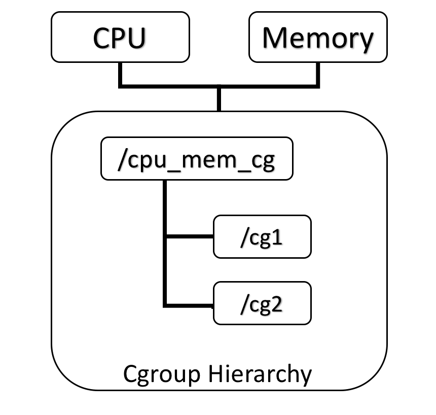
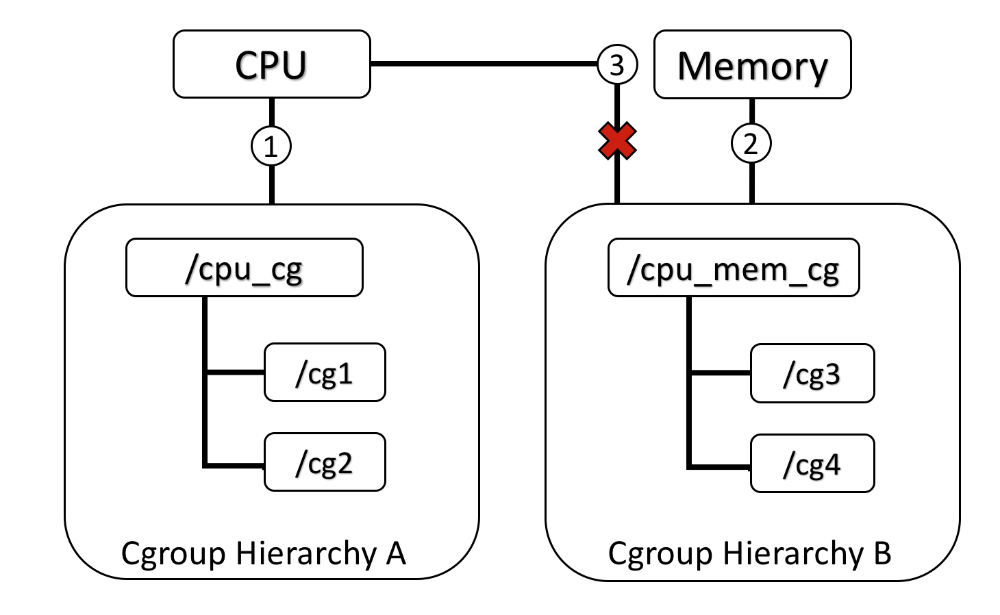
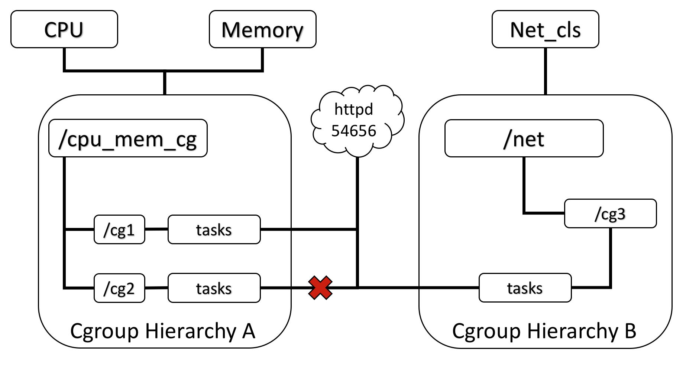
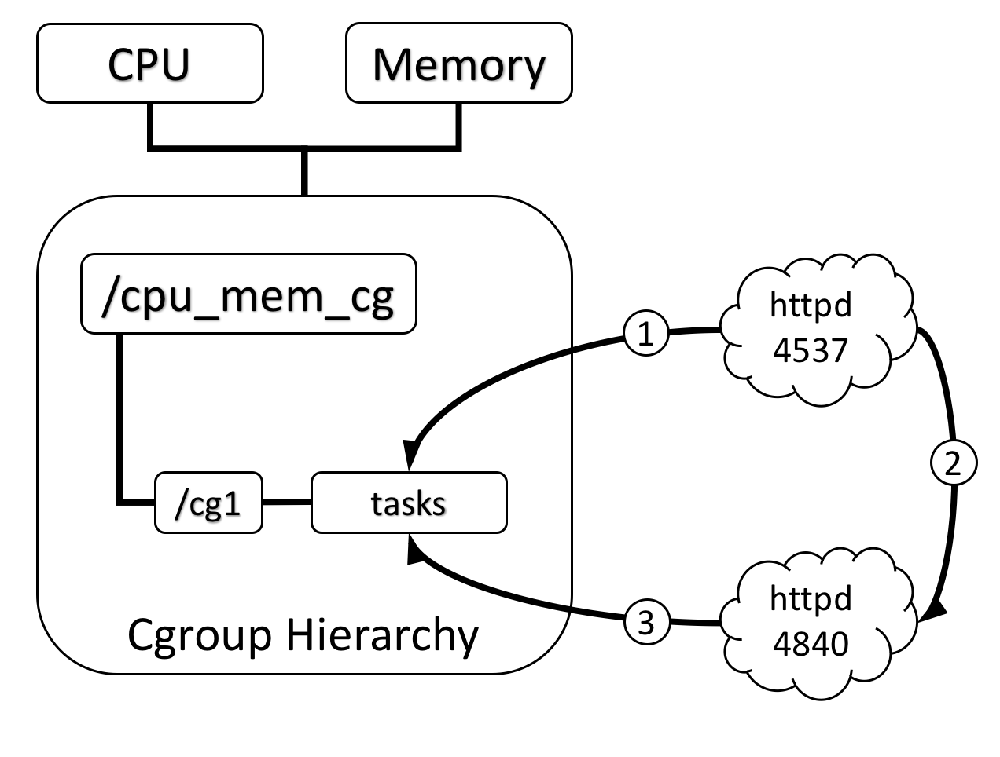

# The concept of cgroup

#### The concept of cgroup

容器的目的是进行**资源隔离**和**控制隔离**。

* 资源隔离：隔离计算资源，如CPU、MEMORY、DISK等。
* 控制隔离：隔离一些控制结构，如UID、PID等

 **资源隔离**依赖于linux内核的Cgroup实现，**控制隔离**依赖于linux内核的namespace.

> The Linux kernel provides the cgroups functionality that allows limitation and prioritization of resources \(CPU, memory, block I/O, network, etc.\) without the need for starting any virtual machines, and also namespace isolation functionality that allows complete isolation of an applications’ view of the operating environment, including process trees, networking, user IDs and mounted file systems.

**What are cgroups ?**

A _cgroup_ associates a set of tasks with a set of parameters for one or more subsystems.

Cgroup将指定的tasks\(processes\)与指定的subsystems关联，从而实现进程的资源控制。

下面通过对subsystems 和 hierarchy的介绍来，来对Cgroup有个更清晰的认识。

安装`libcgroup-tools` 软件包，即可获取`cgroup`的操纵命令。

**subsystem**

subsystem ：resource controller，用来调度和限制进程资源

每个subsystem会自带许多的文件来控制该子系统的资源、

Red Hat Enterprise Linux 7/Centos 7 中可用的管控器

* `blkio` —— 对输入 ∕ 输出访问存取块设备设定权限；
* `cpu` —— 使用 CPU 调度程序让 cgroup 的任务可以存取 CPU。它与 `cpuacct` 管控器一起挂载在同一 mount 上；
* `cpuacct` —— 自动生成 cgroup 中任务占用 CPU 资源的报告。它与 `cpu` 管控器一起挂载在同一 mount 上；
* `cpuset` —— 给 cgroup 中的任务分配独立 CPU（在多芯系统中）和内存节点；
* `devices` —— 允许或禁止 cgroup 中的任务存取设备；
* `freezer` —— 暂停或恢复 cgroup 中的任务；
* `memory` —— 对 cgroup 中的任务可用内存做出限制，并且自动生成任务占用内存资源报告；
* `net_cls` —— 使用等级识别符（classid）标记网络数据包，这让 Linux 流量控制器（`tc`指令）可以识别来自特定 cgroup 任务的数据包；
* `perf_event` —— 允许使用 **perf** 工具来监控 cgroup；
* `hugetlb` —— 允许使用大篇幅的虚拟内存页，并且给这些内存页强制设定可用资源量

```text
## list all subsystems
$ lssubsys  -m  ## 列出挂载点
cpuset /sys/fs/cgroup/cpuset
cpu,cpuacct /sys/fs/cgroup/cpu,cpuacct
blkio /sys/fs/cgroup/blkio
memory /sys/fs/cgroup/memory
devices /sys/fs/cgroup/devices
freezer /sys/fs/cgroup/freezer
net_cls,net_prio /sys/fs/cgroup/net_cls,net_prio
perf_event /sys/fs/cgroup/perf_event
hugetlb /sys/fs/cgroup/hugetlb
pids /sys/fs/cgroup/pids
​
## 每个subsystem中的参数文件
$ ls /sys/fs/cgroup/memory/
cgroup.clone_children  init.scope       memory.kmem.limit_in_bytes      memory.kmem.tcp.max_usage_in_bytes  memory.move_charge_at_immigrate  memory.stat        release_agent
cgroup.event_control   kubepods         memory.kmem.max_usage_in_bytes  memory.kmem.tcp.usage_in_bytes  memory.numa_stat         memory.swappiness  system.slice
cgroup.procs           memory.failcnt       memory.kmem.slabinfo        memory.kmem.usage_in_bytes      memory.oom_control       memory.usage_in_bytes  tasks
cgroup.sane_behavior   memory.force_empty   memory.kmem.tcp.failcnt     memory.limit_in_bytes       memory.pressure_level        memory.use_hierarchy   test_cg
docker             memory.kmem.failcnt  memory.kmem.tcp.limit_in_bytes  memory.max_usage_in_bytes       memory.soft_limit_in_bytes   notify_on_release  user.slice
​
```

**hierarchy**

hierarchy：subsystem mount point

每一个hierarchy即subsystem mount point是一个目录，必有一个或多个subsystem 挂载在上面。

A _hierarchy_ is a set of cgroups arranged in a tree, such that every task in the system is in exactly one of the cgroups in the hierarchy, and a set of subsystems.

**Each hierarchy starts its life as a root cgroup, which initially holds all processes.**

```text
## 列出挂载点 即 root hierarchy
$ lssubsys  -m  
cpuset /sys/fs/cgroup/cpuset
cpu,cpuacct /sys/fs/cgroup/cpu,cpuacct
blkio /sys/fs/cgroup/blkio
memory /sys/fs/cgroup/memory
devices /sys/fs/cgroup/devices
freezer /sys/fs/cgroup/freezer
net_cls,net_prio /sys/fs/cgroup/net_cls,net_prio
perf_event /sys/fs/cgroup/perf_event
hugetlb /sys/fs/cgroup/hugetlb
pids /sys/fs/cgroup/pids

## A single hierarchy can  multi-subsystems attached to it.
$ lssubsys -am
cpu,cpuset,memory /cgroup/cpu_and_mem
net_cls
ns
cpuacct
devices
freezer
blkio
```

Hierarchy的挂载规则

Here are a few simple rules governing the relationships between subsystems, hierarchies of cgroups, and tasks, along with explanations of the consequences of those rules.

Rule1 ： A single hierarchy can have one or more subsystems attached to it.

**同一个hierarchy可以附加一个或多个subsystem**

> ```text
> ## mount -t cgroup -o subsystems name /cgroup/name
> $ mount -t cgroup -o cpu,cpuset,memory cpu_and_mem /cgroup/cpu_and_mem
> $ lssubsys -am
> cpu,cpuset,memory /cgroup/cpu_and_mem
> net_cls
> ns
> cpuacct
> devices
> freezer
> blkio
>
> ## cpu和cpuacct组合使用
> $ ls -l /sys/fs/cgroup/cpu 
> lrwxrwxrwx 1 root root 11 Dec  3 11:57 /sys/fs/cgroup/cpu -> cpu,cpuacct
>
> ```
>
> end



Rule2 :

Any single subsystem \(such as `cpu`\) cannot be attached to more than one hierarchy if one of those hierarchies has a different subsystem attached to it already.

> 如下图，操作③报错
>
> ```text
> $ mkdir /tmp/cg_test
> # mount name: cgroup_root , user define
> # normal mount：mount /dev/vda /tmp/test
> $ mount -t tmpfs cgroup_root /tmp/cg_test/
> $ mkdir  /tmp/cg_test/cpuset
> # 先挂载cpuset subsystem, True
> $ mount -t cgroup -o cpuset cpuset /tmp/cg_test/cpuset
> # 再挂载cpu到mount point时, False
> $ mount -t cgroup -o cpu cpu /tmp/cg_test/cpuset
> mount: cpu is already mounted or /tmp/cg_test/cpuset busy
> ​
> ```
>
> end



Rule3 : Each time a new hierarchy is created on the systems, all tasks on the system are initially members of the default cgroup of that hierarchy, which is known as the _root cgroup_. For any single hierarchy you create, each task on the system can be a member of _exactly one_ cgroup in that hierarchy. A single task may be in multiple cgroups, as long as each of those cgroups is in a different hierarchy. As soon as a task becomes a member of a second cgroup in the same hierarchy, it is removed from the first cgroup in that hierarchy. At no time is a task ever in two different cgroups in the same hierarchy.

**一个task不能存在于同一个hierarchy的不同cgroup中，但是一个task可以存在在不同hierarchy中的多个cgroup中。**如果操作时把一个task添加到同一个hierarchy中的另一个cgroup中，则会从第一个cgroup中移除。在下图3中可以看到，`httpd`进程已经加入到hierarchy A中的`/cg1`而不能加入同一个hierarchy中的`/cg2`，但是可以加入hierarchy B中的`/cg3`。实际上不允许加入同一个hierarchy中的其他cgroup也是为了防止出现矛盾，如CPU subsystem为`/cg1`分配了30%，而为`/cg2`分配了50%，此时如果`httpd`在这两个cgroup中，就会出现矛盾。

> different hierarchy的定义是：没有共同的parent hierarchy？？？
>
> 大多数情况下cpu和memory是分开挂载的。



Rule 4: Any process \(task\) on the system which forks itself creates a child task. A child task automatically inherits the cgroup membership of its parent but can be moved to different cgroups as needed. Once forked, the parent and child processes are completely independent

进程（task）在fork自身时创建的子任务（child task）默认与原task在同一个cgroup中，但是child task允许被移动到不同的cgroup中。即fork完成后，父子进程间是完全独立的。如下图4中，小圈中的数字表示task 出现的时间顺序，当`httpd`刚fork出另一个`httpd`时，在同一个hierarchy中的同一个cgroup中。但是随后如果PID为4840的`httpd`需要移动到其他cgroup也是可以的，因为父子任务间已经独立。总结起来就是：初始化时子任务与父任务在同一个cgroup，但是这种关系随后可以改变。



**task**

Remember that system processes are called tasks in cgroup terminology.

每次只能向cgroup目录中的tasks文件写入一个pid.

You can only attach ONE task at a time.If you have several tasks to attach, you have to do it one after another

```text
1. Note tasks file 
$ /bin/echo PID > tasks
Note that it is PID, not PIDs. You can only attach ONE task at a time.
If you have several tasks to attach, you have to do it one after another:
​
$ /bin/echo PID1 > tasks
$ /bin/echo PID2 > tasks
    ...
$ /bin/echo PIDn > tasks
​
2. libcgrou-tools
$  cgexec  -g memory:mycoolgroup sleep 66000
<blocked>
$ cat /sys/fs/cgroup/memory/mycoolgroup/tasks  ## sleep的pid已被写入该cgroup 的tasks
30799
$ ps -ef |grep sleep
root     30799 30293  0 15:58 pts/4    00:00:00 sleep 66000
root     31012 30464  0 15:58 pts/5    00:00:00 grep sleep
```

**cgroup = \(subsystem+ hierarchy\) + declare new\_cgroup**

当subsystem attached\(mounted\) hierarchy 之后，才能开始创建和使用cgroup

subsystem是内核提供的控制资源的resource controller.

hierarchy是subsystem的mount point常用：`/sys/fs/cgroup/subsystem_name`，称它们为root hierarchy.

cgroup是在root hierarchy下衍生的hierarchy.

```text
## list all cgroups
## <controllers>:<path>
## defines the control groups whose subgroups will be shown. 
 
## 每个/ 下面有好多的control group 
$lscgroup |grep '/$'  
memory:/  （这个/ 即lssubsys -m 显示的root hierarchy的目录  ）
freezer:/
devices:/
net_cls,net_prio:/
perf_event:/
pids:/
cpuset:/
blkio:/
cpu,cpuacct:/
hugetlb:/


## 创建两个cgroup, 继承CPU_Subsystem和Memory_Subsystem
## 即会在cpu和memory的这个两个root hierarchy下各建一个名为mycoolgroup和mycoolgroup/test的目录
## -g <controllers>:<path> controllers即subsystem
## defines  control  groups to be added.  controllers is a list of controllers and path is the relative path to control groups in the given controllers list.
## Charater "*" can be used as a shortcut for "all mounted controllers".
##
$ cgcreate -a root:wyb -g memory,cpu:test_cg    
$ cgcreate -a root:wyb -g memory,cpu:test_cg/test
$ lscgroup |grep test
memory:/test_cg
memory:/test_cg/test
cpu,cpuacct:/test_cg
cpu,cpuacct:/test_cg/test

## 每个subsystem都有许多自带的参数文件来实现资源的限制
$ ls -l /sys/fs/cgroup/memory/test_cg/ |wc -l
29
$ ls -l /sys/fs/cgroup/cpu/test_cg/ |wc -l
13     
## 基于新建的cgroup来启动process
$ cgexec -g memory:test_cg sleep 666  &
[1] 25205
$ cat /sys/fs/cgroup/memory/test_cg/tasks 
25205

$ cat /proc/25205/cgroup 
11:freezer:/
10:cpu,cpuacct:/system.slice/ssh.service
9:perf_event:/
8:memory:/test_cg
7:hugetlb:/
6:devices:/system.slice/ssh.service
5:net_cls,net_prio:/
4:blkio:/system.slice/ssh.service
3:pids:/system.slice/ssh.service
2:cpuset:/
1:name=systemd:/system.slice/ssh.service

## A child task automatically inherits the cgroup membership of its parent
$ systemd-cgls |grep ssh.service -A2
  ├─ssh.service
  │ ├─  648 sleep 666
  │ ├─ 1379 systemd-cgls

​
## 或者 先启动进程，然后将进程pid手动写到cgroup_dir/tasks 文件中
$ sleeep 666 &
[1] 21928
$ echo '21928' > /sys/fs/cgroup/memory/test_cg/tasks
```

**How do I use cgroups ?**

可以直接通过cgcreate和cgexec来操作，简单易懂。

> tmpfs is a kind of RAM FileSystem.
>
> 你需要记住subsystems都是挂载到tmpfs上的
>
> 其实，subsystems的挂载点随便设置啦，只是通常放在`/sys/fs/cgroup/subsystem_name`
>
> 最好是使用RAM文件系统-- RAM启动时加载，断电时消失。

```text
To start a new job that is to be contained within a cgroup, using
the "cpuset" cgroup subsystem, the steps are something like:
# 前三步通常操作系统会自动完成
 1) mount -t tmpfs cgroup_root /sys/fs/cgroup
 2) mkdir /sys/fs/cgroup/cpuset
 # 通过mount参数会自动生成许多参数文件
 3) mount -t cgroup -ocpuset cpuset /sys/fs/cgroup/cpuset
 --------------------------------------------------------
 4) Create the new cgroup by doing mkdir's and write's (or echo's) in
    the /sys/fs/cgroup/cpuset virtual file system.
 5) Start a task that will be the "founding father" of the new job.
 6) Attach that task to the new cgroup by writing its PID to the
    /sys/fs/cgroup/cpuset tasks file for that cgroup.
 7) fork, exec or clone the job tasks from this founding father task.
​
For example, the following sequence of commands will setup a cgroup
named "Charlie", containing just CPUs 2 and 3, and Memory Node 1,
and then start a subshell 'sh' in that cgroup:
​
  mount -t tmpfs cgroup_root /sys/fs/cgroup
  mkdir /sys/fs/cgroup/cpuset
  mount -t cgroup cpuset -ocpuset /sys/fs/cgroup/cpuset
  ## mount -t cgroup -o subsystems name /cgroup/name
  cd /sys/fs/cgroup/cpuset
  # 此处会继承parent directory中的参数文件
  mkdir Charlie
  cd Charlie
  /bin/echo 2-3 > cpuset.cpus
  /bin/echo 1 > cpuset.mems
  # 将当前进程pid写入tasks
  /bin/echo $$ > tasks  
  sh
  # The subshell 'sh' is now running in cgroup Charlie
  # The next line should display '/Charlie'
  cat /proc/self/cgroup
```

end

参考：

[https://www.kernel.org/doc/Documentation/cgroup-v1/cgroups.txt](https://www.kernel.org/doc/Documentation/cgroup-v1/cgroups.txt)

[https://access.redhat.com/documentation/en-us/red\_hat\_enterprise\_linux/6/html/resource\_management\_guide/sec-relationships\_between\_subsystems\_hierarchies\_control\_groups\_and\_tasks](https://access.redhat.com/documentation/en-us/red_hat_enterprise_linux/6/html/resource_management_guide/sec-relationships_between_subsystems_hierarchies_control_groups_and_tasks)

[https://www.infoq.cn/article/docker-kernel-knowledge-cgroups-resource-isolation/?utm\_source=tuicool&utm\_medium=referral](https://www.infoq.cn/article/docker-kernel-knowledge-cgroups-resource-isolation/?utm_source=tuicool&utm_medium=referral)




