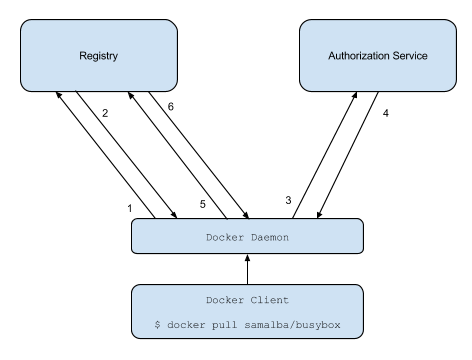

# 核心概念

**image id ane digest and sha256 and tag**

**镜像仓库和docker daemon都使用文件的sha256值作为文件名（或目录名）**，这样文件名变化就是内容发生了变化，直观，讲究。

```text
##  这个文件记录了全部的images 信息
## 所以 docker images 才能读取到
$ cat /var/lib/docker/image/overlay2/repositories.json |python -m json.tool|grep haproxy
        "21.48.0.230/kubeadm/haproxy": {
            "21.48.0.230/kubeadm/haproxy:1.9": "sha256:df80b5c6916756fe19d3d030f345e502b6d484e5e574f5796dfad65a0297bb58",
            "21.48.0.230/kubeadm/haproxy@sha256:f2f5ee848372bd131ec02fd6e8d64f7f412b1ed828d347d16d1e160119441138": "sha256:df80b5c6916756fe19d3d030f345e502b6d484e5e574f5796dfad65a0297bb58"
        "21.49.22.250/test/haproxy": {
            "21.49.22.250/test/haproxy:1.9": "sha256:df80b5c6916756fe19d3d030f345e502b6d484e5e574f5796dfad65a0297bb58",
            "21.49.22.250/test/haproxy@sha256:f2f5ee848372bd131ec02fd6e8d64f7f412b1ed828d347d16d1e160119441138": "sha256:df80b5c6916756fe19d3d030f345e502b6d484e5e574f5796dfad65a0297bb58"
            
## 验证镜像id 和 digest 记录是否有误
$ docker images --no-trunc |grep haproxy
21.48.0.230/kubeadm/haproxy      1.9                 sha256:df80b5c6916756fe19d3d030f345e502b6d484e5e574f5796dfad65a0297bb58   6 months ago        72.2MB
21.49.22.250/test/haproxy        1.9                 sha256:df80b5c6916756fe19d3d030f345e502b6d484e5e574f5796dfad65a0297bb58   6 months ago        72.2MB
$ docker images --digests |grep haproxy
21.48.0.230/kubeadm/haproxy      1.9                 sha256:f2f5ee848372bd131ec02fd6e8d64f7f412b1ed828d347d16d1e160119441138   df80b5c69167        6 months ago        72.2MB
21.49.22.250/test/haproxy        1.9                 sha256:f2f5ee848372bd131ec02fd6e8d64f7f412b1ed828d347d16d1e160119441138   df80b5c69167        6 months ago        72.2MB
​
## 重点，image id 即 images specific 文件的sha256值
## 可以看到，image specification 就是已该file的sha256 值命名的
$ sha256sum /var/lib/docker/image/overlay2/imagedb/content/<sha256>
<sha256 > /var/lib/docker/image/overlay2/imagedb/content/<sha256>
​
##  看文件内容
## 233 可以看出这个haproxy基于amd64平台的镜像而已还可能有arm的哦
## 
$ cat /var/lib/docker/image/overlay2/imagedb/content/<sha256> | python -m json.tool
{   "architecture": "amd64"
    ...
}
```

end

通过api获取image digest

```text
2. 获取token 注意哟，这个token只能下载apline的镜像因为scope里面指定了
$ export token=$(curl -s "https://auth.docker.io/token?service=registry.docker.io&scope=repository:library/alpine:pull" | jq -r .token)
​
3. 获取Digest
# emmm，Harbor中这个Digest也就是blobs中一个实际存储目录名
$ curl -D- -s -H "Accept: application/vnd.docker.distribution.manifest.list.v2+json" -H "Authorization: Bearer $token" "https://registry-1.docker.io/v2/library/alpine/manifests/latest"
HTTP/1.1 200 OK
Content-Length: 1638
Content-Type: application/vnd.docker.distribution.manifest.list.v2+json
## 这个就是image 的 Digest
Docker-Content-Digest: sha256:c19173c5ada610a5989151111163d28a67368362762534d8a8121ce95cf2bd5a
Docker-Distribution-Api-Version: registry/2.0
Etag: "sha256:c19173c5ada610a5989151111163d28a67368362762534d8a8121ce95cf2bd5a"
Date: Thu, 28 Nov 2019 06:32:58 GMT
Strict-Transport-Security: max-age=31536000
## manifests 包含了各个平台的 manifest eg： amd64 、arm等
{
    ...
}
```

end

Docker local： image id

结合Harbor的实际存储来验证，镜像的`Digest(sha256)`确实是Registry的存储目录

`/Harbor_data/registry/docker/registry/v2/blobs/sha256/XX/SHA255` 其中`XX`是`Digest`的前两位、

OpenStack Image 解决了os的依赖。

Docker Image 解决了 Application Libraries的依赖。

Dokcer image的全称： repository\_ip/project\_name/image\_name:tag 具有寻址的功能。

类似互联网中寻找任意主机文件

容器就行拥有IP的独立进程。

**pull images**



1. Attempt to begin a push/pull operation with the registry.
2. If the registry requires authorization it will return a `401 Unauthorized` HTTP response with information on how to authenticate.
3. The registry client makes a request to the authorization service for a Bearer token.
4. The authorization service returns an opaque Bearer token representing the client’s authorized access.
5. The client retries the original request with the Bearer token embedded in the request’s Authorization header.
6. The Registry authorizes the client by validating the Bearer token and the claim set embedded within it and begins the push/pull session as usual.

1.docker client 尝试到registry中进行push/pull操作； 2.registry会返回401未认证信息给client\(未认证的前提下\)，同时返回的信息中还包含了到哪里去认证的信息； 3.client发送认证请求到认证服务器\(authorization service\)； 4.认证服务器\(authorization service\)返回token； 5.client携带这附有token的请求，尝试请求registry； 6.registry接受了认证的token并且使得client继续操作；

 [http://gapme.cn/2017/12/23/docker-pull-inside/](http://gapme.cn/2017/12/23/docker-pull-inside/)

`D:\data_files\MarkDown\py\docker_pull.py` 有代码

1. client尝试去访问registry

   ```text
   reg_service='registry.docker.io'
   # Requests can also ignore verifying the SSL certificate if you set verify to False:
   resp = requests.get('https://{}/v2/'.format(registry), verify=False)
   ```

    Registry server会返回401并且会附带Authentication endpoint:

2. 未认证响应\(Unauthorized response\)

   Authentication server返回的头信息中包含了如何去或许token，它有几个重要的查询参数:

   ```text
   print(resp.headers)
   resp.heades:{'Content-Type': 'application/json', 'Docker-Distribution-Api-Version': 'registry/2.0', 'Www-Authenticate': 'Bearer realm="https://auth.docker.io/token",service="registry.docker.io"', 'Date': 'Tue, 26 Nov 2019 02:10:25 GMT', 'Content-Length': '87', 'Strict-Transport-Security': 'max-age=31536000'}
 
   ##获取realm
   if resp.status_code == 401:
       # auth_url 即 https://auth.docker.io/token
           auth_url = resp.headers['WWW-Authenticate'].split('"')[1]
           try:
                   reg_service = resp.headers['WWW-Authenticate'].split('"')[3]
           except IndexError:
                   reg_service = ""
   ​
   ```

   realm: 描述了认证的enpoint。

   service: 描述了持有资源服务器的名称。

3. && 4 认证endpoint通讯

   ```text
   # Get Docker token and fetch manifest v2 (this part is useless for unauthenticated registries like Microsoft)
   # 获取token用于访问 docker registry
   resp = requests.get('{}?service={}&scope=repository:{}:pull'.format(auth_url, reg_service, repository), verify=False)
   print("resp.json():",resp.json())
   print("resp.status_code:",resp.status_code)
   ​
   # 将认证信息放到headers再次访问registry
   access_token = resp.json()['token']
   auth_head = {'Authorization':'Bearer '+ access_token, 'Accept':'application/vnd.docker.distribution.manifest.v2+json'}
   ​
   --- output---
   resp.json(): {'token': 'truncate', 'access_token': 'truncate', 'expires_in': 300, 'issued_at': '2019-11-26T02:55:12.210775971Z'}
   resp.status_code: 200
   ```

   这里获取都token之后，加载到header再次请求。

4. && 6

   Client尝试与registry连接\(这次带了token信息\)，registry接到请求后验证token，继而开始pull/push操作。

   ```text
   # 对比之前的request
   # resp = requests.get('https://{}/v2/'.format(registry), verify=False)
   resp = requests.get('https://{}/v2/{}/manifests/{}'.format(registry, repository, tag), headers=auth_head, verify=False)
   if (resp.status_code != 200):
           print('[-] Cannot fetch manifest for {} [HTTP {}]'.format(repository, resp.status_code))
           print(resp.content)
           auth_head = {'Authorization':'Bearer '+ access_token, 'Accept':'application/vnd.docker.distribution.manifest.list.v2+json'}
           resp = requests.get('https://{}/v2/{}/manifests/{}'.format(registry, repository, tag), headers=auth_head, verify=False)
           ## 请求成功 --
           if (resp.status_code == 200):
                   print('[+] Manifests found for this tag (use the @digest format to pull the corresponding image):')
                   manifests = resp.json()['manifests']
                   for manifest in manifests:
                           for key, value in manifest["platform"].items():
                                   sys.stdout.write('{}: {}, '.format(key, value))
                           print('digest: {}'.format(manifest["digest"]))
           exit(1)
   layers = resp.json()['layers']
   ​
   ```

   end

Harbor例子使用curl验证 401

**获取操作token401，问题可能是scope指定的image不对（可否去git上提交一波）**

流弊网友： [https://blog.csdn.net/y\_chen\_007/article/details/97525206](https://blog.csdn.net/y_chen_007/article/details/97525206)

说实在的这种情况的401 返回的信息有多少，因为auth server和account都是正确的，但由于scope里面包含的image 路径不对，从而导致了 获取操作权限token失败，直接返回401了。日 ，404不行嘛

```text
 
 ## 排查要细心
  host=21.49.22.250 response.header.connection=keep-alive response.header.content-length=148 response.h
eader.content-type="application/json; charset=utf-8" response.header.date="Tue, 31 Dec 2019 09:45:40 GMT" response.header.docker-distribution-api-version=registry/2.0 response.header.server=nginx response.header.set-cookie="sid=202b00a2e71a1e4d47bafd19783913f0; Path=/; HttpOnly" response.header.www-authenticate="
Bearer realm=\"https://21.49.22.250/service/token\",service=\"harbor-registry\",scope=\"repository:pause:pull\"" response.status="401 Unauthorized" url="https://21.49.22.250/v2/pause/manifests/3.1"
          
 0.0 看日志，明显是这里 scope=\"repository:pause:pull\ 出错了，因为pause镜像的路径写的不对呀
 所以 401了 --- 麻痹因为image路径不对，所以按这个权限去分配token是失败的。
 让我一直怀疑是 registry 认证哪里配错了。shoot
```

end

打开Harbor的nginx的日志，可以看到如下的信息：

```text
## 直接看下portal nginx的日志。
tail /var/log/harbor/
```

* 第一行: Harbor本身检查该tags是否存在
* 第二行：尝试pull，registry v2接口返回401未认证。

  ```text
  ​
  $ curl -ikL -X GET https://192.168.69.128/v2
  HTTP/1.1 301 Moved Permanently
  Server: nginx
  Date: Mon, 09 Apr 2018 09:09:26 GMT
  Content-Type: text/html
  Content-Length: 178
  Location: http://192.168.69.128/v2/
  Connection: keep-alive
  ​
  HTTP/1.1 401 Unauthorized
  Server: nginx
  Date: Mon, 09 Apr 2018 09:09:26 GMT
  Content-Type: application/json; charset=utf-8
  Content-Length: 87
  Connection: keep-alive
  Docker-Distribution-Api-Version: registry/2.0
  Set-Cookie: beegosessionID=f7c73dc9e006a967b95c514014ac49c1; Path=/; HttpOnly
  Www-Authenticate: Bearer realm="https://192.168.69.128/service/token",service="harbor-registry"
  ​
  {"errors":[{"code":"UNAUTHORIZED","message":"authentication required","detail":null}]}
  ```

* 第三行：Registry客户端到获取token，返回Docker客户端。

  ```text
  curl -k -i -u admin:xxx https://example.com/service/token\?account\=admin\&service\=harbor-registry\&scope\=registry:catalog:\*
  HTTP/1.1 200 OK
  Server: nginx
  ...
  ### emm 这篇文章里的怎么不行
  ## \& 转义 & 不然就后端执行了
  ## https://ivanzz1001.github.io/records/post/docker/2018/04/09/docker-harbor-auth-Bearer
  $ curl -ikL -X GET -u admin:Harbor12345 http://192.168.69.128/service/token?account=admin\&service=harbor-registry
  0.0 他的不加scope怎么可以
  ​
  0.0 好烦啊 这个token获取返回 401
 
   ## 排查要细心
    host=21.49.22.250 response.header.connection=keep-alive response.header.content-length=148 response.h
  eader.content-type="application/json; charset=utf-8" response.header.date="Tue, 31 Dec 2019 09:45:40 GMT" response.header.docker-distribution-api-version=registry/2.0 response.header.server=nginx response.header.set-cookie="sid=202b00a2e71a1e4d47bafd19783913f0; Path=/; HttpOnly" response.header.www-authenticate="
  Bearer realm=\"https://21.49.22.250/service/token\",service=\"harbor-registry\",scope=\"repository:pause:pull\"" response.status="401 Unauthorized" url="https://21.49.22.250/v2/pause/manifests/3.1"
          
   0.0 看日志，明显是这里 scope=\"repository:pause:pull\ 出错了，因为pause镜像的路径写的不对呀
   所以 401了 --- 麻痹因为image路径不对，所以按这个权限去分配token是失败的。
   让我一直怀疑是 registry 认证哪里配错了。shoot
  ```

* 第四行：Docker客户端获取镜像的清单。
* 第五行~最后：Docker客户端按照清单，逐层下载镜像数据。

补充一个 `curl -k -I -L https://21.49.22.250`

end

**copy on write**

写时复制，是一项在处理文件时最小化资源占用的技术。只希望读取文件的进程看到的是来自最上层展示的文件———不同容器里的进程可以看到相同的底层文件，因为它们的镜像共享同一个分层。在大多数系统上这样做可以显著降低所需磁盘空间的使用量。当一个容器想要修改一个文件时，该文件会在它被修改前（否则其他容器也能感知到这一变化）复制到该容器所在的分层，这便是写时复制。

**build context**

When you issue a `docker build` command, the current working directory is called the _build context_. By default, the Dockerfile is assumed to be located here, but you can specify a different location with the file flag \(`-f`\). Regardless of where the `Dockerfile` actually lives, all recursive contents of files and directories in the current directory are sent to the Docker daemon as the build context.

wow，Dockerfile 所在的目录就是 build context，该目录下全部东西都会发送到docker daemon。

所以啊，Dockerfile不用乱放 Sending build context to Docker daemon XXX

**cache layers**

Once the cache is invalidated, all subsequent `Dockerfile` commands generate new images and the cache is not used.

Let's take a simple example with a Python application:

```text
FROM python:3.6
​
COPY . /app
WORKDIR /app
​
RUN pip install -r requirements.txt
​
ENTRYPOINT ["python"]
CMD ["ap.py"]
```

It's actually an example I have seen several times online. This looks fine, right?

The problem is that the _COPY . /app_ command will invalidate the cache as soon as any file in the current directory is updated. Let's say you just change the _README_ file and run _docker build_ again. Docker will have to re-install all the requirements because the _RUN pip_ command is run after the _COPY_ that invalidated the cache.

> 真好啊，这个例子。
>
> 要合理利用Image Cache Layer。 每层都以依赖关系，so，如果cache is invalidate则，需要全部生成了
>
> 0.0 这样由于 add/copy 指令操作的文件变数，会增加好多cache layers.
>
> end

The requirements should only be re-installed if the _requirements.txt_ file changes:

```text
FROM python:3.6
​
WORKDIR /app
​
COPY requirements.txt /app/requirements.txt
RUN pip install -r requirements.txt
​
COPY . /app
​
ENTRYPOINT ["python"]
CMD ["ap.py"]
```

With this Dockerfile, the _RUN pip_ command will only be re-run when the _requirements.txt_ file changes. It will use the cache otherwise.

This is much more efficient and will save you quite some time if you have many requirements to install.

啧啧，修正后的帅多了

Conclusion

**Avoid invalidating the cache:**

* start your Dockerfile with commands that should not change often
* put commands that can often invalidate the cache \(like COPY .\) as late as possible
* only add the needed files \(use a .dockerignore file\)

Minimize the number of layers:

* put related commands in the same RUN instruction
* remove files in the same RUN command that created them

0.0 因为是UnionFS所以，删除文件时不可能的了，只是通过whiteout文件屏蔽了--

**Leverage build cache**

0.0 官网的文章真难看啊-- [https://docs.docker.com/develop/develop-images/dockerfile\_best-practices/](https://docs.docker.com/develop/develop-images/dockerfile_best-practices/)

When building an image, Docker steps through the instructions in your `Dockerfile`, executing each in the order specified. As each instruction is examined, Docker looks for an existing image in its cache that it can reuse, rather than creating a new \(duplicate\) image.

If you do not want to use the cache at all, you can use the `--no-cache=true` option on the `docker build` command. However, if you do let Docker use its cache, it is important to understand when it can, and cannot, find a matching image. The basic rules that Docker follows are outlined below:

* Starting with a parent image that is already in the cache, the next instruction is compared against all child images derived from that base image to see if one of them was built using the exact same instruction. If not, the cache is invalidated.

  0.0 --

* In most cases, simply comparing the instruction in the `Dockerfile` with one of the child images is sufficient. However, certain instructions require more examination and explanation.
* For the `ADD` and `COPY` instructions, the contents of the file\(s\) in the image are examined and a checksum is calculated for each file. The last-modified and last-accessed times of the file\(s\) are not considered in these checksums. During the cache lookup, the checksum is compared against the checksum in the existing images. If anything has changed in the file\(s\), such as the contents and metadata, then the cache is invalidated.

  0.0 the `ADD` and `COPY` instructions ,添加的文件一旦发生变化就产生新的 cache--

* Aside from the `ADD` and `COPY` commands, cache checking does not look at the files in the container to determine a cache match. For example, when processing a `RUN apt-get -y update` command the files updated in the container are not examined to determine if a cache hit exists. In that case just the command string itself is used to find a match.

Once the cache is invalidated, all subsequent `Dockerfile` commands generate new images and the cache is not used. 啧啧结合下面的chainid就清楚了。

**清理镜像（garbage collect unused images）**

The Docker daemon does not automatically garbage collect unused images. You can remove unused images using the `docker image prune` \(and the related `docker system prune`\) commands. The `docker image prune` command by default only removes images that are untagged, but using the `--all` option allows you to remove all unused images.

> **Caution:** Running a cron job on each node to periodically garbage collect _can_ be an option for crafting some degree of automation. **Please be advised** that this should be implemented only after careful consideration, as the default behavior carries the risk of unintentional deletion of images critical to the operation of UCP and DTR.

0。0

**Latest tag**

 [https://vsupalov.com/docker-latest-tag/](https://vsupalov.com/docker-latest-tag/) 神作。

**k8s 如何处理latest**

wow，是因为k8s的处理机制，让我一直误以为带`latest`tag的镜像，无论本地是否存在都会去重新拉取`image:latest`。原来这仅仅是k8s处理latest tag的机制。

docker就不会了，你执行`docker run nginx` ，如果本地有`nginx:latest`,则会直接使用本地的镜像。

 Kubernetes is configured to **always** try to pull an image if it’s tagged with :latest. Even if a copy is already available.

 标签为:latest的镜像默认Image PullPolicy 为Always。

**Latest is Just a Tag**

> The ‘latest’ tag does not actually mean latest, it doesn’t mean anything

Some people expect that :latest always points to the most-recently-pushed version of an image. That’s not true.

It’s just the tag which is applied to an image by default which **does not have a tag**. Those two commands will both result in a new image being created and tagged as :latest:

```text
# those two are the same:
$ docker build -t company/image_name .
$ docker build -t company/image_name:latest .
```

**Nothing magical. Just a default value.**

**Latest is Not Dynamic**

即Latest不会永远执行最新的version

> So many people are not realizing that :latest is not dynamic.

If you push a new image with a tag which is neither empty nor ‘latest’, :latest will not be affected or created.

```text
$ docker build -t company/image_name:0.1 .
# :latest doesn't care
$ docker build -t company/image_name
# :latest was created
$ docker build -t company/image_name:0.2 .
# :latest doesn't care . latest不会指向 version 0.2
$ docker build -t company/image_name:latest .
# :latest was updated
```

If you are not pushing it explicitly, the :latest tag will stay the same.

**Is :latest Evil?**

 No. But it’s misunderstood and can be used poorly without much effort.

 “Latest” is just another tag name, but vulnerable to sloppy mistakes by design and people are expecting too much of it.

0.0 本地玩玩latest镜像还是可以的，不用去想tag了。

If you’re a developer, are building images locally for your own consumption and are careful about it - :latest can be a reliable way to save effort and frustration. However, you should not use it for deployments as that practice will backfire badly, repeatedly and in many interesting ways.

If you’re looking for a way to tag your Docker images, a safe bet is to use the Git commit hash as the image tag. This way, you will be able to:

* Tell immediately what code version is running based on the image tag
* Roll back and deploy new versions of your app
* Avoid naming collisions among developers
* Make accidental overwrites harder to do

When using “moving tags”, use custom ones instead of :latest - :stable, :master or a shorter version of semantic versioning are nice examples. This way you can avoid default overwrites by accident. Make sure that your tools handle different images with the same tag well.

**Summary**

And finally, don’t use **moving tag**s for permanent or production deployments. Try to be as precise and specific as possible about what is running to make operations predictable and reliable to save yourself from yet another painful :latest-esque experience.

> You should always be explicit about versioning, otherwise things will break

 _You should avoid using the :latest tag when deploying containers in production, because this makes it hard to track which version of the image is running and hard to roll back._

0.0 使用latest你根本看不到版本号，怎么进行回滚？？？

**images在哪存放（流弊）**

镜像层：

* 客户端: 存储，使用`hashes of uncompressed data`
* distribution: 存储的layer是压缩文件, 使用 `hashes of compressed data`

0.0 记住下面的话即可

Digest是存在在registry的blobs中SHA156，它包含了各个平台（eg：amd64 or arm）的manifest。

Image id：适合本平台的manifest在local 存储时也有一个digest，这个就是image ID

**eg:** 所有的 linux\_amd64是同一个image ID，而linux\_arm又是另一个ID。

The "digest" is a hash of the manifest, **introduced in Docker registry v2.**

> **一个镜像的digest就是镜像的manifes文件的sha256码** 但是是存在Docker registry v2的。
>
> digest避免镜像tag不变，但镜像内容发生了，通过tag无法获取最新镜像的情况。

**The image ID is a hash of the local image JSON configuration.**

 本地由Docker根据镜像的描述文件计算的，并用于`Docker_Root_Dir/imagedb/content/`的目录名称 `SHA256hex(imageConfigJSON)`

0.0 就是将Registry存放在manifest文件，下载到本地后新生成的sha256。

```text
# sha256 /var/lib/docker/image/overlay2/imagedb/content/sha256/5e3..cd
# 可以发现 sha256的值就是文件名。
$ docker inspect centos:7
...
        "Id": "sha256:5e35e350aded98340bc8fcb0ba392d809c807bc3eb5c618d4a0674d98d88bccd",
        "RepoTags": [],
        "RepoDigests": [
            "centos@sha256:4a701376d03f6b39b8c2a8f4a8e499441b0d567f9ab9d58e4991de4472fb813c"
        ],
....
​
4. application/vnd.docker.distribution.manifest.v2+json的headers包含的Docker-Content-Digest至少
符合docker daemon 宿主机的 manifest
（可看到image id）
# -i : includes headers info
$  curl -i -s -H "Accept: application/vnd.docker.distribution.manifest.v2+json" -H "Authorization: Bearer $token" "https://registry-1.docker.io/v2/library/alpine/manifests/latest"
HTTP/1.1 200 OK
Content-Length: 528
Content-Type: application/vnd.docker.distribution.manifest.v2+json
# 注意咯，这个只是amd64平台下的manifest digest
Docker-Content-Digest: sha256:e4355b66995c96b4b468159fc5c7e3540fcef961189ca13fee877798649f531a
Docker-Distribution-Api-Version: registry/2.0
Etag: "sha256:e4355b66995c96b4b468159fc5c7e3540fcef961189ca13fee877798649f531a"
Date: Thu, 28 Nov 2019 06:33:27 GMT
Strict-Transport-Security: max-age=31536000
​
{
   "schemaVersion": 2,
   "mediaType": "application/vnd.docker.distribution.manifest.v2+json",
   "config": {
      "mediaType": "application/vnd.docker.container.image.v1+json",
      "size": 1512,
      ## 这个本地的local manifest digest就是image id了
      "digest": "sha256:965ea09ff2ebd2b9eeec88cd822ce156f6674c7e99be082c7efac3c62f3ff652"
   },
   "layers": [
      {
         "mediaType": "application/vnd.docker.image.rootfs.diff.tar.gzip",
         "size": 2787134,
         "digest": "sha256:89d9c30c1d48bac627e5c6cb0d1ed1eec28e7dbdfbcc04712e4c79c0f83faf17"
      }
   ]
}
​
```

0.0

docker images overlay2

> 镜像由文件和元数据构成。 --
>
> 0.0 但是命名有点奇怪耶，metada干嘛放到content下面，而不是放到metadata下.
>
> ```text
> $ docker images -q|uniq|wc -l
> 27
> ## 而且 image ID 吻合
> $ ls /var/lib/docker/image/overlay2/imagedb/content/sha256/|wc -l  ## 数目吻合
> 27
> $ du -sh  /var/lib/docker/image/overlay2/imagedb/content/sha256/#大小很小，明显是metedata
> 168K    /var/lib/docker/image/overlay2/imagedb/content/sha256/
> ​
> --- image和container 都在 /var/lib/docker/overlay2/ 目录下
> $  du -sh  /var/lib/docker/overlay2/                             
> 9.9G    /var/lib/docker/overlay2/
> ​
> ```
>
> end

[https://segmentfault.com/a/1190000009730986\#articleHeader9](https://segmentfault.com/a/1190000009730986#articleHeader9)

很强的文章

拉取镜像的三种方式：

* docker pull image\_name \(默认tag为latest\)
* docker pull image\_name:tag\_name
* docker pull image\_name@sha256:digest \(这个方式拉的tag为&lt;none&gt;\)

  即使用RepoDigests来标识镜像

取image的大概过程如下：

0.0 emm其实省略了registry和authorization的交互过程

* docker发送image的名称+tag（或者digest）给registry服务器，服务器根据收到的image的名称+tag（或者digest），找到相应image的manifest，然后将manifest返回给docker
* **docker得到manifest后，读取里面image配置文件的digest\(sha256\)，这个sha256码不是image的ID**

  0.0 有点晕了 草这个manifest

  ```text
  $ docker pull centos@sha256:4a701376d03f6b39b8c2a8f4a8e499441b0d567f9ab9d58e4991de4472fb813c
  sha256:4a701376d03f6b39b8c2a8f4a8e499441b0d567f9ab9d58e4991de4472fb813c: Pulling from library/centos
  ab5ef0e58194: Pull complete 
  Digest: sha256:4a701376d03f6b39b8c2a8f4a8e499441b0d567f9ab9d58e4991de4472fb813c
  Status: Downloaded newer image for centos@sha256:4a701376d03f6b39b8c2a8f4a8e499441b0d567f9ab9d58e4991de4472fb813c
  $ docker images
  REPOSITORY                        TAG                 IMAGE ID            CREATED             SIZE
  centos                            <none>              5e35e350aded        2 weeks ago         203MB
  ​
  # 查看镜像的digest的ID
  $ docker inspect Image_id
  ```

  end

  0.0

* 根据ID在本地找有没有存在同样ID的image，有的话就不用继续下载了
* 如果没有，那么会给registry服务器发请求（**里面包含配置文件的sha256和media type**），拿到image的配置文件（Image Config）
* 根据配置文件中的diff\_ids（每个diffid对应一个layer tar包的sha256，tar包相当于layer的原始格式），在本地找对应的layer是否存在
* 如果layer不存在，则根据manifest里面layer的sha256和media type去服务器拿相应的layer（相当去拿压缩格式的包）。
* 拿到后进行解压，并检查解压后tar包的sha256能否和配置文件（Image Config）中的diff\_id对的上，对不上说明有问题，下载失败
* 根据docker所用的后台文件系统类型，解压tar包并放到指定的目录
* 等所有的layer都下载完成后，整个image下载完成，就可以使用了

Docker image 到底在哪放？

> 镜像数据在：`Docker Root Dir`/`Storage Driver`/cache\_id
>
> eg: `/var/lib/docker/overlay2/*`
>
> 这个cache\_id 依赖关系在`Docker Root Dir`/image/`Storage Driver`/layerdb/sha256/cache-id里面记录。
>
> ```text
> $cat /var/lib/docker/image/overlay2/layerdb/sha256/fda831348202bb0db409fad657e67d08cc866bc6b2c87ea1ecfea0903bbb5caa/cache-id
> 07fd1e5861ef3ad4b576d142e4890e14ada231cb727dba4a4bddd32a3327b347
> ​
> $ ls /var/lib/docker/overlay2/07fd1e5861ef3ad4b576d142e4890e14ada231cb727dba4a4bddd32a3327b347/
> diff  link  lower  work
> ​
> ```
>
> 每层直接的依赖关系都在`Docker Root Dir`/image/`Storage Driver`/layerdb/sha256/cache-id中定义。

Images 怎么存储目录对应

layer的属性信息都放在了`Docker Root Dir`/image/`Storage Driver`/layerdb/sha256目录下，目录名称是layer的chainid，由于最底层的layer的chainid和diffid相同，所以`chainid` 就是本身。

> 如何求chainid：
>
> 最底层的：chain\_id == diff\_id
>
> 计算chainid时，用到了所有祖先layer的信息，从而能保证根据chainid得到的rootfs是唯一的。
>
> `echo -n "sha256:Parent_chain_id sha256:diff_id" |sha256sum` 得到该层对应的chainid
>
> end

```text
$ docker info|grep  'Storage Driver'
Storage Driver: overlay2
$ docker info|grep  'Root'
Docker Root Dir: /var/lib/docker
root@fishong:/var/lib/docker# du -sh ./*
20K ./builder
792K    ./containerd
4.3M    ./containers
16M ./image
128K    ./network
6.3G    ./overlay2  --- 这里
20K ./plugins
4.0K    ./runtimes
4.0K    ./swarm
4.0K    ./tmp
4.0K    ./trust
1.2G    ./volumes
​
## 那么具体一个镜像对象哪些overlay2的目录呢？
1. 找到镜像的Image Config 文件,拿到镜像的RootFS由哪些layers组成
$ docker images nginx          
REPOSITORY          TAG                 IMAGE ID            CREATED             SIZE
nginx               <none>              568c4670fa80        5 days ago          109MB
$ cat /var/lib/docker/image/overlay2/imagedb/content/sha256/568c4670fa800978e08e4a51132b995a54f8d5ae83ca133ef5546d092b864acf |jq
...
  "rootfs": {
    "type": "layers",
    # 从上到下依次是从底层到顶层
    # 确实是3层，docker pull nginx也可以看到只下载了三层
    ## 再确认查看hub.docker上的Dockerfike也只有两个RUN指令。
    "diff_ids": [
      "sha256:ef68f6734aa485edf13a8509fe60e4272428deaf63f446a441b79d47fc5d17d3",  ##最底层
      "sha256:ad5345cbb119f7c720123e3adf28b164143e4157ca6e46a629ca694e75f7825f",  ## 第二层
      "sha256:ece4f9fdef598687f23d39643bacbf2c609201b087b93bbae81b931da72d2a64"   ## 第三层
    ]
2. 根据chainid目录下cache-id找到：layer metadata
-- 底层
$ cd /var/lib/docker/image/overlay2/layerdb/sha256
#cache-id是docker下载layer的时候在本地生成的一个随机uuid，
#指向真正存放layer文件的地方
$ cat ef68f6734aa485edf13a8509fe60e4272428deaf63f446a441b79d47fc5d17d3/cache-id
b1acb2ed8732e3d4d07aa44444bd98b4863df2634212c390ecdc337821376f17
$ cd /var/lib/docker/overlay2/b1acb2ed8732e3d4d07aa44444bd98b4863df2634212c390ecdc337821376f17
$ ls
diff  link
$ du -sh ./
62M ./
3. zheg
-- 第二层的cache-id和parent
$ echo  -n "sha256:ef68f6734aa485edf13a8509fe60e4272428deaf63f446a441b79d47fc5d17d3 sha256:ad5345cbb119f7c720123e3adf28b164143e4157ca6e46a629ca694e75f7825f" | sha256sum  
6b9d35d8d75115937cd78da275f527cccef672cbd71f34062dffe2e930fd7e13  -
$ cd /var/lib/docker/overlay2/layerdb/sha256
$ cat sha256/6b9d35d8d75115937cd78da275f527cccef672cbd71f34062dffe2e930fd7e13/parent   
sha256:ef68f6734aa485edf13a8509fe60e4272428deaf63f446a441b79d47fc5d17d3
$ cat sha256/6b9d35d8d75115937cd78da275f527cccef672cbd71f34062dffe2e930fd7e13/cache-id 
7d407e11dcbde25b1685eb5a5fde08a653ba525a29d0ebc82e39ed98bfbe5a1f
0.0 元数据大小咯
$ du -sh /var/lib/docker/overlay2/7d407e11dcbde25b1685eb5a5fde08a653ba525a29d0ebc82e39ed98bfbe5a1f/ 
54M /var/lib/docker/overlay2/7d407e11dcbde25b1685eb5a5fde08a653ba525a29d0ebc82e39ed98bfbe5a1f/
​
--- 第三层的cache-id和parent
## 计算第三层的chainid： 即第二层的chainid 与 第三层diffid
$ echo  -n "sha256:6b9d35d8d75115937cd78da275f527cccef672cbd71f34062dffe2e930fd7e13 sha256:ece4f9fdef598687f23d39643bacbf2c609201b087b93bbae81b931da72d2a64" | sha256sum -
ac0442c0fafd48e24a96fa3099ea7ad20012c8759e1dd03dd387dbfbe382984c  -
$ ls /var/lib/docker/image/overlay2/layerdb/sha256/ac0442c0fafd48e24a96fa3099ea7ad20012c8759e1dd03dd387dbfbe382984c/
cache-id  diff  parent  size  tar-split.json.gz
 
 0.0 yes
```

end

首先Docker Image由什么构成:

一个image由[manifest](https://github.com/opencontainers/image-spec/blob/master/manifest.md)、[image index](https://github.com/opencontainers/image-spec/blob/master/image-index.md) \(可选\)、[filesystem layers](https://github.com/opencontainers/image-spec/blob/master/layer.md)和[configuration](https://github.com/opencontainers/image-spec/blob/master/config.md)四部分组成。

> docker image id 即 local manifest的sha256
>
> docker 上并没有存manifest文件，只存了Image Config

```text
                    +-----------------------+
                    | Image Index(optional) |
                    +-----------------------+
                               |
                               | 1..*
                               ↓
                    +----------------------+
                    |    Image Manifest    |
                    +----------------------+
                               |
                     1..1      |     1..*
               +---------------+--------------+
               |                              |
               ↓                              ↓
       +--------------+             +-------------------+
       | Image Config |             | Filesystem Layers |
       +--------------+             +-------------------+
```

* Image Index和Manifest的关系是"1..\*"，表示它们是一对多的关系
* Image Manifest和Config的关系是"1..1"，表示它们是一对一的关系
* Image Manifest和Filesystem Layers是一对多的关系

end

Digest and Image ID

首先 Digest 和 Image ID是不同的。

The short answer is:

* The "digest" is a hash of the manifest, introduced in Docker registry v2.
* **The image ID is a hash of the local image JSON configuration.**
* image manifest的sha256 ， Image Mainfest和 Image Config是一对一的关系。

  manifest里面包含的内容就是对config和layer的sha256 + media type描述，目的就是为了下载config和layer，等image下载完成后，manifest的使命就完成了，里面的信息对于image的本地管理来说没什么用，所以docker在本地没有单独的存储一份manifest文件与之对应。

  ```text
  ### Image Config's sha256 is equal image ID
  $ cat /var/lib/docker/image/overlay2/imagedb/content/sha256/568c4670fa800978e08e4a51132b995a54f8d5ae83ca133ef5546d092b864acf | jq
  ​
  ## 0.0 这个sha256 和docker images 显示的 IMAGE ID 一致
  $ docker images --no-trunc nginx
  REPOSITORY TAG     IMAGE ID        CREATED             SIZE                                                
  nginx  <none>            sha256:568c4670fa800978e08e4a51132b995a54f8d5ae83ca133ef5546d092b864acf   5 days ago          109MB
  ```

* Digest 是 Docker Repository 提供的docker image 唯一标识

  docker 可以通过 pull image\_name@sha256:digest来拉取镜像

end

为什么要设置digest？

 对于某些image来说，可能在发布之后还会做一些更新，比如安全方面的，这时虽然镜像的内容变了，但镜像的名称和tag没有变，所以会造成前后两次通过同样的名称和tag从服务器得到不同的两个镜像的问题，于是docker引入了镜像的digest的概念，**一个镜像的digest就是镜像的manifes文件的sha256码**，当镜像的内容发生变化的时候，即镜像的layer发生变化，从而layer的sha256发生变化，而manifest里面包含了每一个layer的sha256，所以manifest的sha256也会发生变化，即镜像的digest发生变化，这样就保证了digest能唯一的对应一个镜像。

```text
 $ docker images
    REPOSITORY       TAG                 IMAGE ID            CREATED             SIZE
    nginx           latest              568c4670fa80        5 days ago          109MB
    $ docker rmi 568
    Untagged: nginx:latest
    Untagged: nginx@sha256:5d32f60db294b5deb55d078cd4feb410ad88e6fe77500c87d3970eca97f54dba
    Deleted: sha256:568c4670fa800978e08e4a51132b995a54f8d5ae83ca133ef5546d092b864acf
    Deleted: sha256:ac0442c0fafd48e24a96fa3099ea7ad20012c8759e1dd03dd387dbfbe382984c
    Deleted: sha256:6b9d35d8d75115937cd78da275f527cccef672cbd71f34062dffe2e930fd7e13
    Deleted: sha256:ef68f6734aa485edf13a8509fe60e4272428deaf63f446a441b79d47fc5d17d3
    
    ### 通过digest 即sha256 hash pull image
 $ docker pull nginx@sha256:5d32f60db294b5deb55d078cd4feb410ad88e6fe77500c87d3970eca97f54dba
    sha256:5d32f60db294b5deb55d078cd4feb410ad88e6fe77500c87d3970eca97f54dba: Pulling from library/nginx
    a5a6f2f73cd8: Pull complete 
    1ba02017c4b2: Pull complete 
    33b176c904de: Pull complete 
    Digest: sha256:5d32f60db294b5deb55d078cd4feb410ad88e6fe77500c87d3970eca97f54dba
    Status: Downloaded newer image for nginx@sha256:5d32f60db294b5deb55d078cd4feb410ad88e6fe77500c87d3970eca97f54dba
    $ docker images
    REPOSITORY            TAG                 IMAGE ID            CREATED             SIZE
    nginx                <none>              568c4670fa80        5 days ago          109MB
```

end

**Images: Tagging vs Digest**

多个tag可以对应一个Digest？？

 services resolve the tag you specified to a digest, and pull that image by digest \(if it doesn't exist locally\). Doing so guarantees that every instance of the service \(on any node\) runs exactly the same version of the image.

那么ImageID和 Digest的关系呢

 **A docker image is an immutable merkle tree of its layers and config.** The digest is the sha256 of the manifest and can be used to definitively refer to an image.

**image Manifest Version 2, Schema 2（digest详解）**

`、`

**Media type**

The following media types are used by the manifest formats described here, and the resources they reference:

* `application/vnd.docker.distribution.manifest.v1+json`: schema1 \(existing manifest format\)
* `application/vnd.docker.distribution.manifest.v2+json`: New image manifest format \(schemaVersion = 2\)
* `application/vnd.docker.distribution.manifest.list.v2+json`: Manifest list, aka "fat manifest"

  ```text
  ## 输出结果是不一样的
  ## 
  root@fishong:/tmp# curl -D- -s -H "Accept: application/vnd.docker.distribution.manifest.list.v2+json" -H "Authorization: Bearer $token" "https://registry-1.docker.io/v2/library/nginx/manifests/1.12" |grep Docker-Content-Digest
  Docker-Content-Digest: sha256:72daaf46f11cc753c4eab981cbf869919bd1fee3d2170a2adeac12400f494728
  root@fishong:/tmp# curl -D- -s -H "Accept: application/vnd.docker.distribution.manifest.v2+json" -H "Authorization: Bearer $token" "https://registry-1.docker.io/v2/library/nginx/manifests/1.12"|grep Docker-Content-Digest
  Docker-Content-Digest: sha256:09e210fe1e7f54647344d278a8d0dee8a4f59f275b72280e8b5a7c18c560057f
  ```

  0.0 注意了解，"fat manifest"

* `application/vnd.docker.container.image.v1+json`: Container config JSON
* `application/vnd.docker.image.rootfs.diff.tar.gzip`: "Layer", as a gzipped tar
* `application/vnd.docker.image.rootfs.foreign.diff.tar.gzip`: "Layer", as a gzipped tar that should never be pushed
* `application/vnd.docker.plugin.v1+json`: Plugin config JSON

**Manifest list**

The manifest list is the "fat manifest" which points to specific image manifests for one or more platforms. Its use is optional, and relatively few images will use one of these manifests. A client will **distinguish** a manifest list from an image manifest based on the Content-Type returned in the HTTP response.

> 这个Manifest list的Docker-Content-Digest就是Image Digest.

先说结论：

Manifest list 是指向所有平台的下的manifest的总和，它的`Docker-Content-Digest`就是镜像的`Digest` 即

可以通过`docker pull image_name@sha256:XXX` 来获取镜像

Manifest 只是某个平台下的镜像格式，所以使用`application/vnd.docker.distribution.manifest.v2+json`作为请求头获得的`Docker-Content-Digest`不是镜像的`Digest`只是镜像在某平台下的`Digest`

0.0 它的返回值正文内容，本地的manifest的digest就是image id

> 结合Harbor的实际存储来验证，镜像的`Digest(sha256)`确实是Registry的存储目录
>
> `/Harbor_data/registry/docker/registry/v2/blobs/sha256/XX/SHA255` 其中`XX`是`Digest`的前两位、

下面来例证

```text
1. 查看alpine latest的Digest 和 imageID
$ docker images --digests |grep alpine
alpine sha256:c19173c5ada610a5989151111163d28a67368362762534d8a8121ce95cf2bd5a   965ea09ff2eb     
2. 获取token 注意哟，这个token只能下载apline的镜像因为scope里面指定了
$ export token=$(curl -s "https://auth.docker.io/token?service=registry.docker.io&scope=repository:library/alpine:pull" | jq -r .token)
​
3. 获取Digest
# emmm，Harbor中这个Digest也就是blobs中一个实际存储目录名
$ curl -D- -s -H "Accept: application/vnd.docker.distribution.manifest.list.v2+json" -H "Authorization: Bearer $token" "https://registry-1.docker.io/v2/library/alpine/manifests/latest"
HTTP/1.1 200 OK
Content-Length: 1638
Content-Type: application/vnd.docker.distribution.manifest.list.v2+json
## 这个就是image 的 Digest
Docker-Content-Digest: sha256:c19173c5ada610a5989151111163d28a67368362762534d8a8121ce95cf2bd5a
Docker-Distribution-Api-Version: registry/2.0
Etag: "sha256:c19173c5ada610a5989151111163d28a67368362762534d8a8121ce95cf2bd5a"
Date: Thu, 28 Nov 2019 06:32:58 GMT
Strict-Transport-Security: max-age=31536000
## manifests 包含了各个平台的 manifest eg： amd64 、arm等
{
    "manifests": [{
        "digest": "sha256:e4355b66995c96b4b468159fc5c7e3540fcef961189ca13fee877798649f531a",
        "mediaType": "application\/vnd.docker.distribution.manifest.v2+json",
        "platform": {
            "architecture": "amd64",
            "os": "linux"
        },
        "size": 528
    }, {
        "digest": "sha256:29a82d50bdb8dd7814009852c1773fb9bb300d2f655bd1cd9e764e7bb1412be3",
        "mediaType": "application\/vnd.docker.distribution.manifest.v2+json",
        "platform": {
            "architecture": "arm",
            "os": "linux",
            "variant": "v6"
        },
        "size": 528
    }, {
        "digest": "sha256:915a0447d045e3b55f84e8456de861571200ee39f38a0ce70a45f91c29491a21",
        "mediaType": "application\/vnd.docker.distribution.manifest.v2+json",
        "platform": {
            "architecture": "arm",
            "os": "linux",
            "variant": "v7"
        },
        "size": 528
    }, {
        "digest": "sha256:1827be57ca85c28287d18349bbfdb3870419692656cb67c4cd0f5042f0f63aec",
        "mediaType": "application\/vnd.docker.distribution.manifest.v2+json",
        "platform": {
            "architecture": "arm64",
            "os": "linux",
            "variant": "v8"
        },
        "size": 528
    }, {
        "digest": "sha256:77cbe97593c890eb1c4cadcbca37809ebff2b5f46a036666866c99f08a708967",
        "mediaType": "application\/vnd.docker.distribution.manifest.v2+json",
        "platform": {
            "architecture": "386",
            "os": "linux"
        },
        "size": 528
    }, {
        "digest": "sha256:6dff84dbd39db7cb0fc928291e220b3cff846e59334fd66f27ace0bcfd471b75",
        "mediaType": "application\/vnd.docker.distribution.manifest.v2+json",
        "platform": {
            "architecture": "ppc64le",
            "os": "linux"
        },
        "size": 528
    }, {
        "digest": "sha256:d8d321ec5eec88dee69aec467a51fe764daebdb92ecff0d1debd09840cbd86c6",
        "mediaType": "application\/vnd.docker.distribution.manifest.v2+json",
        "platform": {
            "architecture": "s390x",
            "os": "linux"
        },
        "size": 528
    }],
    "mediaType": "application\/vnd.docker.distribution.manifest.list.v2+json",
    "schemaVersion": 2
}
​
4. application/vnd.docker.distribution.manifest.v2+json的headers包含的Docker-Content-Digest至少
符合docker daemon 宿主机的 manifest
（可看到image id）
# -i : includes headers info
$  curl -i -s -H "Accept: application/vnd.docker.distribution.manifest.v2+json" -H "Authorization: Bearer $token" "https://registry-1.docker.io/v2/library/alpine/manifests/latest"
HTTP/1.1 200 OK
Content-Length: 528
Content-Type: application/vnd.docker.distribution.manifest.v2+json
## 这个e43 和上面的 amd64 linux 中的 digest 一样--
Docker-Content-Digest: sha256:e4355b66995c96b4b468159fc5c7e3540fcef961189ca13fee877798649f531a
Docker-Distribution-Api-Version: registry/2.0
Etag: "sha256:e4355b66995c96b4b468159fc5c7e3540fcef961189ca13fee877798649f531a"
Date: Thu, 28 Nov 2019 06:33:27 GMT
Strict-Transport-Security: max-age=31536000
​
{
   "schemaVersion": 2,
   "mediaType": "application/vnd.docker.distribution.manifest.v2+json",
   "config": {
      "mediaType": "application/vnd.docker.container.image.v1+json",
      "size": 1512,
      ## 这个本地的local manifest digest就是image id了
      "digest": "sha256:965ea09ff2ebd2b9eeec88cd822ce156f6674c7e99be082c7efac3c62f3ff652"
   },
   "layers": [
      {
         "mediaType": "application/vnd.docker.image.rootfs.diff.tar.gzip",
         "size": 2787134,
         "digest": "sha256:89d9c30c1d48bac627e5c6cb0d1ed1eec28e7dbdfbcc04712e4c79c0f83faf17"
      }
   ]
}
```

**Docker Registry HTTP API V2**

0.0 详细的API

 真的可看：[https://github.com/docker/distribution/blob/master/docs/spec/api.md](https://github.com/docker/distribution/blob/master/docs/spec/api.md)

不过，它和Harbor的不一样。、但你还得了解，因为你要从官方registry下载镜像在传到Harbor。

 [https://github.com/docker/distribution/issues/2395](https://github.com/docker/distribution/issues/2395)

