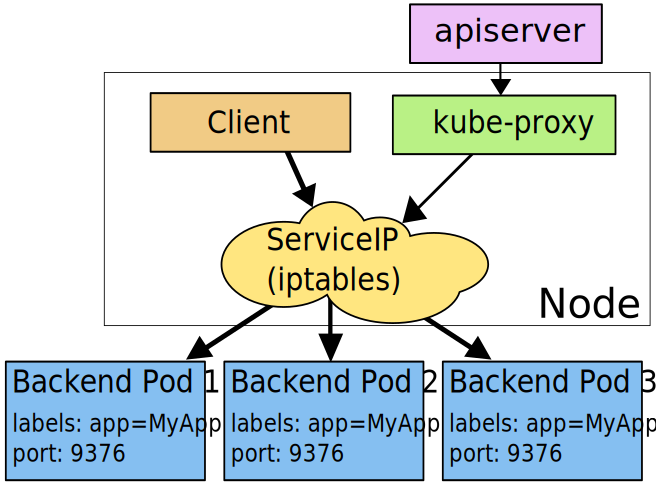
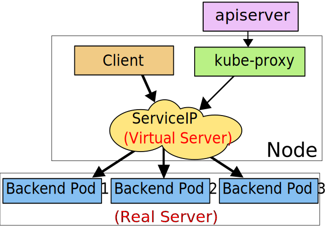

# kube-proxy

#### kube-proxy

The Kubernetes network proxy runs on each node. This reflects services as defined in the Kubernetes API on each node and can do simple TCP, UDP, and SCTP stream forwarding or round robin TCP, UDP, and SCTP forwarding across a set of backends.

> SCTP: Stream Control Transmission Protocol，流控协议

kube-proxy的实现迭代了三个版本：userspace mode、iptables mode and ipvs mode。

**Proxy-mode: userspace**

In the userspace mode, the iptables rule forwards to a local port where a go binary \(kube-proxy\) is listening for connections. The binary \(running in userspace\) terminates the connection, establishes a new connection to a backend for the service, and then forwards requests to the backend and responses back to the local process. An advantage of the userspace mode is that because the connections are created from an application, if the connection is refused, the application can retry to a different backend.

> 可见，这种mode最大的问题是，service的请求会先从用户空间进入内核iptables，然后再回到用户空间，由kube-proxy完成后端Endpoints的选择和代理工作，这样流量从用户空间进出内核带来的性能损耗是不可接受的。

这种模式的好处就是kube-proxy可以对它发起的连接提供一定容错性，比如像backend Pod1 请求失败后，它可以转向backend Pod2.但是种模式性能太差，已经摒弃。

Client --&gt; ServiceIP\(iptables\) --&gt; kube-proxy --&gt; Backend Pod

即User--&gt; kernel --&gt; User


Note：iptables本身不具备防火墙功能，是通过内核的netfilter来实现。

**Proxy-mode: iptables**

In iptables mode, the iptables rules are installed to directly forward packets that are destined for a service to a backend for the service. This is more efficient than moving the packets from the kernel to kube-proxy and then back to the kernel so it results in higher throughput and better tail latency. The main downside is that it is more difficult to debug, because instead of a local binary that writes a log to `/var/log/kube-proxy` you have to inspect logs from the kernel processing iptables rules.

这种实现模式，iptables会直接将包转发到后端Pod上，减少流量在用户空间的传输，从而有更高的吞吐量和更低的延时。但是也由于流量不经过`kube-proxy`了，所以排除问题时无法从`kube-proxy`的日志中查看了，只能去详细的排查iptables rules...

In this mode, kube-proxy watches the Kubernetes control plane for the addition and removal of Service and Endpoint objects. For each Service, it installs iptables rules, which capture traffic to the Service’s `clusterIP` and `port`, and redirect that traffic to one of the Service’s backend sets. For each Endpoint object, it installs iptables rules which select a backend Pod.

`kube-proxy`通过watch Service and Endpoint objects events，来对iptables rules进行增删改查，从而将客户端请求通过iptables直接发送到对应的后端pods.



By default, kube-proxy in iptables mode chooses a backend at random.

> iptables 支持的LB策略很少，也不没有错误重试机制
>
> Random balancing
>
> Notice that 3 different probabilities are defined and not 0.33 everywhere. The reason is that the rules are executed sequentially.
>
> 第一个rule，占33%的比重（With a probability of 0.33, the first rule will be executed 33% of the time and skipped 66% of the time.），第二条，则声明占50%的比重。
>
> 但是由于iptables是顺序执行的，所以在执行第二条规则时，它的基数不是1而是66%即的权重实际为66% \* 0.5=33%，同理第三条规则的权重是1，但由于它的基数是33%,所以它的实际权重也是33%。
>
> ```text
> ## kube-proxy针对某个service生成的iptables rules
> ## 3个backend pods
> $ iptables -vnL -t nat
>     0     0 KUBE-SVC-IRQMVLXPTV3OE7TS  tcp  --  *      *       0.0.0.0/0            10.3.161.186         /* default/zk-cs:client cluster IP */ tcp dpt:2181
>     
> Chain KUBE-SVC-IRQMVLXPTV3OE7TS (1 references)
>  pkts bytes target     prot opt in     out     source               destination
>     0     0 KUBE-SEP-YAY6MH2K7LE5HQWM  all  --  *      *       0.0.0.0/0            0.0.0.0/0            /* default/zk-cs:client */ statistic mode random probability 0.33332999982
>     0     0 KUBE-SEP-WCNFPSY7SZWMFGFW  all  --  *      *       0.0.0.0/0            0.0.0.0/0            /* default/zk-cs:client */ statistic mode random probability 0.50000000000
>     0     0 KUBE-SEP-2L7L5L3R44FHMOIR  all  --  *      *       0.0.0.0/0            0.0.0.0/0            /* default/zk-cs:client */
>     
> ## 类似
> iptables -A PREROUTING -t nat -p tcp -d 192.168.1.1 --dport 27017 \
>          -m statistic --mode random --probability 0.33            \
>          -j DNAT --to-destination 10.0.0.2:1234
> iptables -A PREROUTING -t nat -p tcp -d 192.168.1.1 --dport 27017 \
>          -m statistic --mode random --probability 0.5             \
>          -j DNAT --to-destination 10.0.0.3:1234
> iptables -A PREROUTING -t nat -p tcp -d 192.168.1.1 --dport 27017 \
>          -j DNAT --to-destination 10.0.0.4:1234
> ```
>
> Round Robin
>
> The other way to do this is to use the `nth` algorithm. This algorithm implements a [round robin algorithm](https://en.wikipedia.org/wiki/Round-robin_scheduling).
>
> This algorithm takes two different parameters: `every` \(`n`\) and `packet`\(`p`\). The rule will be evaluated every `n` packet starting at the packet `p`.
>
> To load balance between three different hosts you will need to create those three rules:
>
> ```text
> iptables -A PREROUTING -t nat -p tcp -d 192.168.1.1 --dport 27017 \
>          -m statistic --mode nth --every 3 --packet 0              \
>          -j DNAT --to-destination 10.0.0.2:1234
> iptables -A PREROUTING -t nat -p tcp -d 192.168.1.1 --dport 27017 \
>          -m statistic --mode nth --every 2 --packet 0              \
>          -j DNAT --to-destination 10.0.0.3:1234
> iptables -A PREROUTING -t nat -p tcp -d 192.168.1.1 --dport 27017 \
>          -j DNAT --to-destination 10.0.0.4:1234
> ```
>
> end

iptables-mode中，无法`ping`通过`ClusterIP`因为它只存在iptables中，没有任何接口承载它。

**Proxy-mode：ipvs**

iptables 难以扩展到成千上万的服务，因为它纯粹是为防火墙而设计的，基于内核规则列表来实现，当k8s集群中大量的services，查找和新增规则时会有很高的延时。

In `ipvs` mode, kube-proxy watches Kubernetes Services and Endpoints, calls `netlink` interface to create IPVS rules accordingly and synchronizes IPVS rules with Kubernetes Services and Endpoints periodically. This control loop ensures that IPVS status matches the desired state. When accessing a Service, IPVS directs traffic to one of the backend Pods.

> 该模式依赖内核模块： `ip_vs`、`ip_vs_rr`、`ip_vs_wrr`、`ip_vs_sh`、`nf_conntrack` and `br_netfilter`

kube-proxy 的 IPVS 模式和iptables类似，kube-proxy监控Services and Endpoint的变化并创建相应的ipvs rules，然后经由lvs中的VIP直接转发到后端pod.



Similar to iptables, Ipvs is based on netfilter hook function, but uses hash table as the underlying data structure and works in the kernel space. That means ipvs redirects traffic much faster, and has much better performance when syncing proxy rules.

ipvs模式下仍然使用`iptables`的查找逻辑，但将查找对象换成了`ipset`（Hash Table,work in kernel space），且用`lvs scheduler`替代了`iptables`的负载算法。

IPVS模式的核心就是：

* 使用ipset集合代替iptables上大量service对应的iptables rules，使得iptables数量固定，且通过hash table查找也很高效。即将k8s的service ips写入到ipset的集合中，iptables去调用指定set即可。

  IPVS-mode离不开iptables，只是作了优化。

  ```text
  ## clusterIPs 都在预定义的set中，而不会出现在iptables rules,这样就不会有大量的iptables rules
  $ ipset -L |grep KUBE-CLUSTER-IP -A 13
  Name: KUBE-CLUSTER-IP
  Type: hash:ip,port
  Revision: 5
  Header: family inet hashsize 1024 maxelem 65536
  Size in memory: 440
  References: 2
  Number of entries: 5
  Members:
  10.96.0.1,tcp:443
  10.96.0.10,tcp:53
  10.96.6.131,tcp:80
  10.96.0.10,tcp:9153
  10.96.0.10,udp:53
  ​
  ​
  ## If kube-proxy starts with --cluster-cidr=, the IPVS proxier will masquerade off-cluster traffic accessing service ClusterIP, which behaves same as what iptables proxier does. 
  $ iptables-save |grep KUBE-CLUSTER-IP
  -A KUBE-SERVICES ! -s 10.244.0.0/16 -m comment --comment "Kubernetes service cluster ip + port for masquerade purpose" -m set --match-set KUBE-CLUSTER-IP dst,dst -j KUBE-MARK-MASQ
  -A KUBE-SERVICES -m set --match-set KUBE-CLUSTER-IP dst,dst -j ACCEPT
  ```

* ipvs作为lvs中的scheduling-method，为k8s的services提供更多的loadbalance methods和其他信息。

  使用`ipvsadm` 对连接状态监控和问题排查都比查看iptables rules方便很多

   ipvs provides more options for load balancing algorithm, such as:

  * `rr`: round-robin
  * `lc`: least connection
  * `dh`: destination hashing
  * `sh`: source hashing
  * `sed`: shortest expected delay
  * `nq`: never queue

  ```text
  # ipvs支持跟多种负载算法
  # 默认是rr
  $ ipvsadm -l
  IP Virtual Server version 1.2.1 (size=4096)
  Prot LocalAddress:Port Scheduler Flags
    -> RemoteAddress:Port           Forward Weight ActiveConn InActConn
  TCP  10.96.0.1:https rr
    -> dodo:sun-sr-https            Masq    1      0          0
  ...
  # 模拟请求
  $ for i in {1..100};do sleep 1; curl -I 10.96.6.131;done
  # 查看转发情况
  $  ipvsadm -ln --rate
  IP Virtual Server version 1.2.1 (size=4096)
  Prot LocalAddress:Port                 CPS    InPPS   OutPPS    InBPS   OutBPS
    -> RemoteAddress:Port
  ...
  TCP  10.96.6.131:80                      1        4        2      234      268
    -> 10.244.210.154:80                   0        1        1       98      113
    -> 10.244.210.155:80                   0        2        1      135      155
  ...
  ​
  ## 使用ipvs设置连接的tcp 参数
  ## 三个参数依次为： tcp_keepalive_time tcp_fin_wait_time udp_time
  $ ipvsadm -l --timeout
  Timeout (tcp tcpfin udp): 900 120 300
  $ ipvsadm --set 900 30 300
  $ ipvsadm -l --timeout
  Timeout (tcp tcpfin udp): 900 30 300
  ```

* dummy interface

  有了这个dummy interface使得，我们可以直接`ping ClusetrIP`.

  IPVS-mode will create a dummy interface and assign all kubernetes service ClusterIP's to the dummy interface \(default name is `kube-ipvs0`\). For example:

  ```text
  $ ip link add kube-ipvs0 type dummy
  ​
  #### Assume 10.96.6.131 is service Cluster IP
  $ ip a |grep 10.96.6.131
      inet 10.96.6.131/32 brd 10.96.6.131 scope global kube-ipvs0
  ​
  $ ping 10.96.6.131 -c 2
  PING 10.96.6.131 (10.96.6.131) 56(84) bytes of data.
  64 bytes from 10.96.6.131: icmp_seq=1 ttl=64 time=0.087 ms
  64 bytes from 10.96.6.131: icmp_seq=2 ttl=64 time=0.072 ms
  ​
  --- 10.96.6.131 ping statistics ---
  2 packets transmitted, 2 received, 0% packet loss, time 999ms
  rtt min/avg/max/mdev = 0.072/0.079/0.087/0.011 ms
  ​
  $  ip route  list   table local
  local 10.96.0.1 dev kube-ipvs0 proto kernel scope host src 10.96.0.1
  local 10.96.0.10 dev kube-ipvs0 proto kernel scope host src 10.96.0.10
  local 10.96.6.131 dev kube-ipvs0 proto kernel scope host src 10.96.6.131
  ...
  ```

总结： ipvs-mode通过ipset减少了大量的iptables rules，优化service的增改时间；ipvs提供了优秀的负载方法和更便捷的排查方法。

**IPVS proxier and iptables**

前面提到了ipvs-mode主要是通过ipset和ipvs来对iptables-modes的性能和负载做了优化，其他的实现还是通过iptables来实现的，比如：SNAT

```text
# pod network namespace
$ nsenter -t 21400  -n -p -i bash
$ ip a
1: lo: <LOOPBACK,UP,LOWER_UP> mtu 65536 qdisc noqueue state UNKNOWN group defau                                                           lt qlen 1000
    link/loopback 00:00:00:00:00:00 brd 00:00:00:00:00:00
    inet 127.0.0.1/8 scope host lo
       valid_lft forever preferred_lft forever
2: tunl0@NONE: <NOARP> mtu 1480 qdisc noop state DOWN group default qlen 1000
    link/ipip 0.0.0.0 brd 0.0.0.0
4: eth0@if14: <BROADCAST,MULTICAST,UP,LOWER_UP> mtu 1440 qdisc noqueue state UP                                                            group default
    link/ether 9a:6f:73:7c:b8:81 brd ff:ff:ff:ff:ff:ff link-netnsid 0
    inet 10.244.210.155/32 scope global eth0
       valid_lft forever preferred_lft forever
       
# 查看公网ip地址
$ curl ip.sb
115.194.123.239
​
# run curl command in pod net_ns
$ curl 47.75.134.240
<html>
<head><title>403 Forbidden</title></head>
<body bgcolor="white">
<center><h1>403 Forbidden</h1></center>
<hr><center>nginx/1.10.2</center>
</body>
</html>
​
## 在目标机器上抓包
## SNAT 还是借助 iptables实现的
## 访问集群外的流量显示的都是nodeip
$ tcpdump port 80 and host 115.194.123.239
tcpdump: verbose output suppressed, use -v or -vv for full protocol decode
listening on eth0, link-type EN10MB (Ethernet), capture size 262144 bytes
22:17:03.086341 IP 115.194.123.239.60392 > fishong.http: Flags [S], seq 3440763009, win 28000, options [mss 1400,sackOK,TS val 25669068 ecr 0,nop,wscale 7], length 0
22:17:03.086572 IP fishong.http > 115.194.123.239.60392: Flags [S.], seq 1136606105, ack 3440763010, win 28960, options [mss 1460,sackOK,TS val 199272660 ecr 25669068,nop,wscale 7], length 0
22:17:03.123856 IP 115.194.123.239.60392 > fishong.http: Flags [.], ack 1, win 219, options [nop,nop,TS val 25669116 ecr 199272660], length 0
22:17:03.126291 IP 115.194.123.239.60392 > fishong.http: Flags [P.], seq 1:78, ack 1, win 219, options [nop,nop,TS val 25669117 ecr 199272660], length 77: HTTP: GET / HTTP/1.1
22:17:03.126377 IP fishong.http > 115.194.123.239.60392: Flags [.], ack 78, win 227, options [nop,nop,TS val 199272670 ecr 25669117], length 0
22:17:03.126467 IP fishong.http > 115.194.123.239.60392: Flags [P.], seq 1:325, ack 78, win 227, options [nop,nop,TS val 199272670 ecr 25669117], length 324: HTTP: HTTP/1.1 403 Forbidden
22:17:03.164873 IP 115.194.123.239.60392 > fishong.http: Flags [.], ack 325, win 228, options [nop,nop,TS val 25669156 ecr 199272670], length 0
22:17:03.165414 IP 115.194.123.239.60392 > fishong.http: Flags [F.], seq 78, ack 325, win 228, options [nop,nop,TS val 25669156 ecr 199272670], length 0
22:17:03.165539 IP fishong.http > 115.194.123.239.60392: Flags [F.], seq 325, ack 79, win 227, options [nop,nop,TS val 199272679 ecr 25669156], length 0
22:17:03.224303 IP 115.194.123.239.60392 > fishong.http: Flags [.], ack 326, win 228, options [nop,nop,TS val 25669215 ecr 199272679], length 0
^C
10 packets captured
10 packets received by filter
0 packets dropped by kernel
​
​
```

IPVS proxier will employ iptables in doing packet filtering, SNAT and supporting NodePort type service. Specifically, ipvs proxier will fall back on iptables in the following 4 scenarios.

* kube-proxy start with --masquerade-all=true
* Specify cluster CIDR in kube-proxy startup
* Load Balancer Source Ranges is specified for LB type service
* Support NodePort type service

And, IPVS proxier will maintain 5 kubernetes-specific chains in nat table

* KUBE-POSTROUTING
* KUBE-MARK-MASQ
* KUBE-MARK-DROP

`KUBE-POSTROUTING`, `KUBE-MARK-MASQ`, `KUBE-MARK-DROP` are maintained by kubelet and ipvs proxier won't create them. IPVS proxier will make sure chains `KUBE-MARK-SERVICES` and `KUBE-NODEPORTS` exist in its sync loop.

IPVS proxier will fall back on IPTABLES in the following scenarios.

**1. kube-proxy start with `--masquerade-all=true`**

If kube-proxy starts with `--masquerade-all=true`, the IPVS proxier will masquerade all traffic accessing service ClusterIP, which behaves same as what iptables proxier does.

> If using the pure iptables proxy, SNAT all traffic sent via Service cluster IPs \(this not commonly needed\).

如果 kube-proxy 配置了--masquerade-all=true参数，所以访问ipvs VIP\(cluster IPs\)的流量都会被SNAT

```text
# 所有访问clusterIP的流量，响应时都snat成clusterIP去响应。
$ iptables -t nat -nL|grep  KUBE-CLUSTER-IP
target          prot opt source               destination  
KUBE-MARK-MASQ  all  --  0.0.0.0/0            0.0.0.0/0            /* Kubernetes service cluster ip + port for masquerade purpose */ match-set KUBE-CLUSTER-IP dst,dst
​
```

**2. Specify cluster CIDR in kube-proxy startup**

If kube-proxy starts with `--cluster-cidr=`, the IPVS proxier will masquerade off-cluster traffic accessing service ClusterIP, which behaves same as what iptables proxier does.

> The CIDR range of pods in the cluster. When configured, traffic sent to a Service cluster IP from outside this range will be masqueraded and traffic sent from pods to an external LoadBalancer IP will be directed to the respective cluster IP instead.

如果 kube-proxy 配置了--cluster-cidr=&lt;cidr&gt;参数，则非集群内ip访问service IP时，会被SNAT.

要明白一点，Service IP是VIP不会以client形式出现在路由中的，所以这个`--cluster-cid`填的是pod subnets.

```text
# 使用 MASQUERADE 进行与 Pod subnet 相关的 SNAT，实际上这是将 pod 的源 ip SNAT 为 service ip。
# 集群内部pod访问时，不需要做snat
# https://zhuanlan.zhihu.com/p/87063321
$ iptables -t nat -nL|grep  KUBE-CLUSTER-IP
target         prot opt source               destination  
KUBE-MARK-MASQ  all  -- !10.244.0.0/16        0.0.0.0/0            /* Kubernetes service cluster ip + port for masquerade purpose */ match-set KUBE-CLUSTER-IP             dst,dst


## 已知harbor不是k8s node
## 即非--cluster-cidr访问clusterIP时，会进行snat转换，用clusterIP响应 Harbor Server的请求
[root@cs1-harbor-1 ~]# tcpdump -n -i any port 8080 and "tcp[tcpflags] & (tcp-syn) != 0"
tcpdump: verbose output suppressed, use -v or -vv for full protocol decode
listening on any, link-type LINUX_SLL (Linux cooked), capture size 262144 bytes
10:46:06.436999 IP 21.49.22.1.43358 > 10.102.102.13.webcache: Flags [S], seq 349794772, win 29200, options [mss 1460,sackOK,TS val 2719584191 ecr 0,nop,wscale 7], length 0
10:46:06.437010 IP 21.49.22.1.43358 > 10.102.102.13.webcache: Flags [S], seq 349794772, win 29200, options [mss 1460,sackOK,TS val 2719584191 ecr 0,nop,wscale 7], length 0
10:46:06.437333 IP 10.102.102.13.webcache > 21.49.22.1.43358: Flags [S.], seq 3605680494, ack 349794773, win 27760, options [mss 1400,sackOK,TS val 906087535 ecr 2719584191,nop,wscale 7], l
ength 010:46:06.437333 IP 10.102.102.13.webcache > 21.49.22.1.43358: Flags [S.], seq 3605680494, ack 349794773, win 27760, options [mss 1400,sackOK,TS val 906087535 ecr 2719584191,nop,wscale 7], l
ength 0


[root@cs1-harbor-1 ~]# curl 10.102.102.13:8080
CLIENT VALUES:
client_address=21.49.22.7
command=GET
real path=/
query=nil
request_version=1.1
request_uri=http://10.102.102.13:8080/

SERVER VALUES:
server_version=nginx: 1.10.0 - lua: 10001

HEADERS RECEIVED:
accept=*/*
host=10.102.102.13:8080
user-agent=curl/7.29.0
BODY:
-no body in request-


----

## 但是k8s内部pod间的访问是不需要masquerade，直接pod 进行响应
[root@cs1-k8s-n1 ~]# curl 10.102.102.13:8080
CLIENT VALUES:
client_address=21.49.22.7
command=GET
real path=/
query=nil
request_version=1.1
request_uri=http://10.102.102.13:8080/

SERVER VALUES:
server_version=nginx: 1.10.0 - lua: 10001

HEADERS RECEIVED:
accept=*/*
host=10.102.102.13:8080
user-agent=curl/7.29.0
BODY:
-no body in request-

## 在client上抓关于service ip的包是空白的
[root@cs1-k8s-n1 ~]# tcpdump -n -i any  port 8080  and host 10.102.102.13
tcpdump: verbose output suppressed, use -v or -vv for full protocol decode
listening on any, link-type LINUX_SLL (Linux cooked), capture size 262144 bytes
^C
0 packets captured
140 packets received by filter
93 packets dropped by kernel


[root@cs1-k8s-n1 ~]# curl 10.102.102.13:8080
CLIENT VALUES:
client_address=172.17.0.1
command=GET
real path=/
query=nil
request_version=1.1
request_uri=http://10.102.102.13:8080/

SERVER VALUES:
server_version=nginx: 1.10.0 - lua: 10001

HEADERS RECEIVED:
accept=*/*
host=10.102.102.13:8080
user-agent=curl/7.29.0
BODY:
-no body in request-

## 查看该svc对应的后端pod ip即Real Server 
[root@cs1-k8s-n1 ~]# ipvsadm -l|grep -A 5 10.102.102.13
TCP  10.102.102.13:webcache rr
  -> 192.168.1.160:webcache       Masq    1      0          1         
  -> 192.168.1.161:webcache       Masq    1      0          1         
  -> 192.168.118.113:webcache     Masq    1      0          0 
  
# 不加-e 抓包显示的是172.27.0.1 docker0的地址作为client，有点奇怪
[root@cs1-k8s-n1 ~]# tcpdump -i any -n  -e  host 192.168.118.113 or 192.168.1.160 or 192.168.1.161
tcpdump: verbose output suppressed, use -v or -vv for full protocol decode
listening on any, link-type LINUX_SLL (Linux cooked), capture size 262144 bytes
11:04:06.413667 Out e0:4f:43:dd:ac:b1 ethertype IPv4 (0x0800), length 76: 21.49.22.7.54302 > 192.168.1.161.webcache: Flags [S], seq 1087246176, win 43690, options [mss 65495,sackOK,TS val 1
226037074 ecr 0,nop,wscale 7], length 011:04:06.413678 Out e0:4f:43:dd:ac:b1 ethertype IPv4 (0x0800), length 76: 21.49.22.7.54302 > 192.168.1.161.webcache: Flags [S], seq 1087246176, win 43690, options [mss 65495,sackOK,TS val 1
226037074 ecr 0,nop,wscale 7], length 011:04:06.413861  In e8:61:1f:26:d5:e1 ethertype IPv4 (0x0800), length 76: 192.168.1.161.webcache > 21.49.22.7.54302: Flags [S.], seq 1173116939, ack 1087246177, win 27760, options [mss 1400
,sackOK,TS val 907167511 ecr 1226037074,nop,wscale 7], length 011:04:06.413861  In e8:61:1f:26:d5:e1 ethertype IPv4 (0x0800), length 76: 192.168.1.161.webcache > 21.49.22.7.54302: Flags [S.], seq 1173116939, ack 1087246177, win 27760, options [mss 1400
,sackOK,TS val 907167511 ecr 1226037074,nop,wscale 7], length 011:04:06.413947 Out e0:4f:43:dd:ac:b1 ethertype IPv4 (0x0800), length 68: 21.49.22.7.54302 > 192.168.1.161.webcache: Flags [.], ack 1, win 342, options [nop,nop,TS val 1226037074 ecr 907167
511], length 011:04:06.413951 Out e0:4f:43:dd:ac:b1 ethertype IPv4 (0x0800), length 68: 21.49.22.7.54302 > 192.168.1.161.webcache: Flags [.], ack 1, win 342, options [nop,nop,TS val 1226037074 ecr 907167
511], length 011:04:06.414117 Out e0:4f:43:dd:ac:b1 ethertype IPv4 (0x0800), length 150: 21.49.22.7.54302 > 192.168.1.161.webcache: Flags [P.], seq 1:83, ack 1, win 342, options [nop,nop,TS val 122603707
4 ecr 907167511], length 82: HTTP: GET / HTTP/1.111:04:06.414130 Out e0:4f:43:dd:ac:b1 ethertype IPv4 (0x0800), length 150: 21.49.22.7.54302 > 192.168.1.161.webcache: Flags [P.], seq 1:83, ack 1, win 342, options [nop,nop,TS val 122603707
4 ecr 907167511], length 82: HTTP: GET / HTTP/1.111:04:06.414233  In e8:61:1f:26:d5:e1 ethertype IPv4 (0x0800), length 68: 192.168.1.161.webcache > 21.49.22.7.54302: Flags [.], ack 83, win 217, options [nop,nop,TS val 907167512 ecr 122603
7074], length 011:04:06.414233  In e8:61:1f:26:d5:e1 ethertype IPv4 (0x0800), length 68: 192.168.1.161.webcache > 21.49.22.7.54302: Flags [.], ack 83, win 217, options [nop,nop,TS val 907167512 ecr 122603
7074], length 011:04:06.414601  In e8:61:1f:26:d5:e1 ethertype IPv4 (0x0800), length 617: 192.168.1.161.webcache > 21.49.22.7.54302: Flags [P.], seq 1:550, ack 83, win 217, options [nop,nop,TS val 9071675
12 ecr 1226037074], length 549: HTTP: HTTP/1.1 200 OK11:04:06.414601  In e8:61:1f:26:d5:e1 ethertype IPv4 (0x0800), length 617: 192.168.1.161.webcache > 21.49.22.7.54302: Flags [P.], seq 1:550, ack 83, win 217, options [nop,nop,TS val 9071675
12 ecr 1226037074], length 549: HTTP: HTTP/1.1 200 OK11:04:06.414625 Out e0:4f:43:dd:ac:b1 ethertype IPv4 (0x0800), length 68: 21.49.22.7.54302 > 192.168.1.161.webcache: Flags [.], ack 550, win 350, options [nop,nop,TS val 1226037075 ecr 9071
67512], length 011:04:06.414628 Out e0:4f:43:dd:ac:b1 ethertype IPv4 (0x0800), length 68: 21.49.22.7.54302 > 192.168.1.161.webcache: Flags [.], ack 550, win 350, options [nop,nop,TS val 1226037075 ecr 9071
67512], length 011:04:06.414903 Out e0:4f:43:dd:ac:b1 ethertype IPv4 (0x0800), length 68: 21.49.22.7.54302 > 192.168.1.161.webcache: Flags [F.], seq 83, ack 550, win 350, options [nop,nop,TS val 1226037075
 ecr 907167512], length 011:04:06.414913 Out e0:4f:43:dd:ac:b1 ethertype IPv4 (0x0800), length 68: 21.49.22.7.54302 > 192.168.1.161.webcache: Flags [F.], seq 83, ack 550, win 350, options [nop,nop,TS val 1226037075
 ecr 907167512], length 011:04:06.415082  In e8:61:1f:26:d5:e1 ethertype IPv4 (0x0800), length 68: 192.168.1.161.webcache > 21.49.22.7.54302: Flags [F.], seq 550, ack 84, win 217, options [nop,nop,TS val 907167513 
ecr 1226037075], length 011:04:06.415082  In e8:61:1f:26:d5:e1 ethertype IPv4 (0x0800), length 68: 192.168.1.161.webcache > 21.49.22.7.54302: Flags [F.], seq 550, ack 84, win 217, options [nop,nop,TS val 907167513 
ecr 1226037075], length 011:04:06.415124 Out e0:4f:43:dd:ac:b1 ethertype IPv4 (0x0800), length 68: 21.49.22.7.54302 > 192.168.1.161.webcache: Flags [.], ack 551, win 350, options [nop,nop,TS val 1226037075 ecr 9071
67513], length 011:04:06.415128 Out e0:4f:43:dd:ac:b1 ethertype IPv4 (0x0800), length 68: 21.49.22.7.54302 > 192.168.1.161.webcache: Flags [.], ack 551, win 350, options [nop,nop,TS val 1226037075 ecr 9071
67513], length 0
        
```

**3. Load Balancer Source Ranges is specified for LB type service**

When service's `LoadBalancerStatus.ingress.IP` is not empty and service's `LoadBalancerSourceRanges` is specified, IPVS proxier will install iptables rules which looks like what is shown below.

Suppose service's `LoadBalancerStatus.ingress.IP` is `10.96.1.2` and service's `LoadBalancerSourceRanges` is `10.120.2.0/24`:

**4. Support NodePort type service**

Please check the section below.

**How the IPVS proxier works\(还没好好整理\)**

**Supporting NodePort service**

For supporting NodePort type service, iptables will recruit the existing implementation in the iptables proxier. For example,

```text
# kubectl describe svc nginx-service
Name:           nginx-service
...
Type:           NodePort
IP:             10.101.28.148
Port:           http    3080/TCP
NodePort:       http    31604/TCP
Endpoints:      172.17.0.2:80
Session Affinity:   None
​
# iptables -t nat -nL
​
[root@100-106-179-225 ~]# iptables -t nat -nL
Chain PREROUTING (policy ACCEPT)
target     prot opt source               destination         
KUBE-SERVICES  all  --  0.0.0.0/0            0.0.0.0/0            /* kubernetes service portals */
​
Chain OUTPUT (policy ACCEPT)
target     prot opt source               destination         
KUBE-SERVICES  all  --  0.0.0.0/0            0.0.0.0/0            /* kubernetes service portals */
​
Chain KUBE-SERVICES (2 references)
target     prot opt source               destination         
KUBE-MARK-MASQ  tcp  -- !172.16.0.0/16        10.101.28.148        /* default/nginx-service:http cluster IP */ tcp dpt:3080
KUBE-SVC-6IM33IEVEEV7U3GP  tcp  --  0.0.0.0/0            10.101.28.148        /* default/nginx-service:http cluster IP */ tcp dpt:3080
KUBE-NODEPORTS  all  --  0.0.0.0/0            0.0.0.0/0            /* kubernetes service nodeports; NOTE: this must be the last rule in this chain */ ADDRTYPE match dst-type LOCAL
​
Chain KUBE-NODEPORTS (1 references)
target     prot opt source               destination         
KUBE-MARK-MASQ  tcp  --  0.0.0.0/0            0.0.0.0/0            /* default/nginx-service:http */ tcp dpt:31604
KUBE-SVC-6IM33IEVEEV7U3GP  tcp  --  0.0.0.0/0            0.0.0.0/0            /* default/nginx-service:http */ tcp dpt:31604
​
Chain KUBE-SVC-6IM33IEVEEV7U3GP (2 references)
target     prot opt source               destination
KUBE-SEP-Q3UCPZ54E6Q2R4UT  all  --  0.0.0.0/0            0.0.0.0/0            /* default/nginx-service:http */
Chain KUBE-SEP-Q3UCPZ54E6Q2R4UT (1 references)
target     prot opt source               destination         
KUBE-MARK-MASQ  all  --  172.17.0.2           0.0.0.0/0            /* default/nginx-service:http */
DNAT  
```

**Supporting ClusterIP service**

When creating a ClusterIP type service, IPVS proxier will do 3 things:

* make sure dummy interface exists in the node
* bind service cluster IP to the dummy interface
* create an IPVS service whose address corresponds to the Kubernetes service Cluster IP.

For example,

```text
# kubectl describe svc nginx-service
Name:           nginx-service
...
Type:           ClusterIP
IP:             10.102.128.4
Port:           http    3080/TCP
Endpoints:      10.244.0.235:8080,10.244.1.237:8080
Session Affinity:   None
​
# ip addr
...
73: kube-ipvs0: <BROADCAST,NOARP> mtu 1500 qdisc noop state DOWN qlen 1000
    link/ether 1a:ce:f5:5f:c1:4d brd ff:ff:ff:ff:ff:ff
    inet 10.102.128.4/32 scope global kube-ipvs0
       valid_lft forever preferred_lft forever
​
# ipvsadm -ln
IP Virtual Server version 1.2.1 (size=4096)
Prot LocalAddress:Port Scheduler Flags
  -> RemoteAddress:Port           Forward Weight ActiveConn InActConn     
TCP  10.102.128.4:3080 rr
  -> 10.244.0.235:8080            Masq    1      0          0         
  -> 10.244.1.237:8080            Masq    1      0          0   
```

**Support LoadBalancer service**

IPVS proxier will NOT bind LB's ingress IP to the dummy interface. When creating a LoadBalancer type service, ipvs proxier will do 4 things:

* Make sure dummy interface exists in the node
* Bind service cluster IP to the dummy interface
* Create an ipvs service whose address corresponding to kubernetes service Cluster IP
* Iterate LB's ingress IPs, create an ipvs service whose address corresponding LB's ingress IP

For example,

```text
# kubectl describe svc nginx-service
Name:           nginx-service
...
IP:             10.102.128.4
Port:           http    3080/TCP
Endpoints:      10.244.0.235:8080
Session Affinity:   None
​
#### Only bind Cluster IP to dummy interface
# ip addr
...
73: kube-ipvs0: <BROADCAST,NOARP> mtu 1500 qdisc noop state DOWN qlen 1000
    link/ether 1a:ce:f5:5f:c1:4d brd ff:ff:ff:ff:ff:ff
    inet 10.102.128.4/32 scope global kube-ipvs0
       valid_lft forever preferred_lft forever
​
#### Suppose LB's ingress IPs {10.96.1.2, 10.93.1.3}. IPVS proxier will create 1 ipvs service for cluster IP and 2 ipvs services for LB's ingree IP. Each ipvs service has its destination.
# ipvsadm -ln
IP Virtual Server version 1.2.1 (size=4096)
Prot LocalAddress:Port Scheduler Flags
  -> RemoteAddress:Port           Forward Weight ActiveConn InActConn     
TCP  10.102.128.4:3080 rr
  -> 10.244.0.235:8080            Masq    1      0          0           
TCP  10.96.1.2:3080 rr  
  -> 10.244.0.235:8080            Masq    1      0          0   
TCP  10.96.1.3:3080 rr  
  -> 10.244.0.235:8080            Masq    1      0          0   
```

Since there is a need of supporting access control for `LB.ingress.IP`. IPVS proxier will fall back on iptables. Iptables will drop any packet which is not from `LB.LoadBalancerSourceRanges`. For example,

```text
# iptables -A KUBE-SERVICES -d {ingress.IP} --dport {service.Port} -s {LB.LoadBalancerSourceRanges} -j ACCEPT
```

When the packet reach the end of chain, ipvs proxier will drop it.

```text
# iptables -A KUBE-SERVICES -d {ingress.IP} --dport {service.Port} -j KUBE-MARK-DROP
```

**Support Only NodeLocal Endpoints**

Similar to iptables proxier, when a service has the "Only NodeLocal Endpoints" annotation, ipvs proxier will only proxy traffic to endpoints in the local node.

```text
# kubectl describe svc nginx-service
Name:           nginx-service
...
IP:             10.102.128.4
Port:           http    3080/TCP
Endpoints:      10.244.0.235:8080, 10.244.1.235:8080
Session Affinity:   None
​
#### Assume only endpoint 10.244.0.235:8080 is in the same host with kube-proxy
​
#### There should be 1 destination for ipvs service.
[root@SHA1000130405 home]# ipvsadm -ln
IP Virtual Server version 1.2.1 (size=4096)
Prot LocalAddress:Port Scheduler Flags
  -> RemoteAddress:Port           Forward Weight ActiveConn InActConn     
TCP  10.102.128.4:3080 rr
  -> 10.244.0.235:8080            Masq    1      0          0               
```

**Session affinity**

IPVS support client IP session affinity \(persistent connection\). When a service specifies session affinity, the IPVS proxier will set a timeout value \(180min=10800s by default\) in the IPVS service. For example,

> 缺陷：没有容错能力，若此RS宕机，则会话丢失，并且将同一请求发送到同一RS有损均衡效果

```text
# kubectl describe svc nginx-service
Name:           nginx-service
...
IP:             10.102.128.4
Port:           http    3080/TCP
Session Affinity:   ClientIP
​
# ipvsadm -ln
IP Virtual Server version 1.2.1 (size=4096)
Prot LocalAddress:Port Scheduler Flags
  -> RemoteAddress:Port           Forward Weight ActiveConn InActConn
TCP  10.102.128.4:3080 rr persistent 10800
```

**Cleaning up inactive rules**

It seems difficult to distinguish if an IPVS service is created by the IPVS proxier or other processes. Currently we assume IPVS rules will be created only by the IPVS proxier on a node, so we can clear all IPVSrules on a node. We should add warnings in documentation and flag comments.

**Sync loop pseudo code**

Similar to the iptables proxier, the IPVS proxier will do a full sync loop in a configured period. Also, each update on a Kubernetes service or endpoint will trigger an IPVS service or destination update. For example,

* Creating a Kubernetes service will trigger creating a new IPVS service.
* Updating a Kubernetes service\(for instance, change session affinity\) will trigger updating an existing IPVS service.
* Deleting a Kubernetes service will trigger deleting an IPVS service.
* Adding an endpoint for a Kubernetes service will trigger adding a destination for an existing IPVS service.
* Updating an endpoint for a Kubernetes service will trigger updating a destination for an existing IPVS service.
* Deleting an endpoint for a Kubernetes service will trigger deleting a destination for an existing IPVS service.

Any IPVS service or destination updates will send an update command to kernel via socket communication, which won't take a service down.

The sync loop pseudo code is shown below:

```text
func (proxier *Proxier) syncProxyRules() {
    When service or endpoint update, begin sync ipvs rules and iptables rules if needed.
    ensure dummy interface exists, if not, create one.
    for svcName, svcInfo := range proxier.serviceMap {
      // Capture the clusterIP.
      construct ipvs service from svcInfo
      Set session affinity flag and timeout value for ipvs service if specified session affinity
      bind Cluster IP to dummy interface
      call libnetwork API to create ipvs service and destinations
​
      // Capture externalIPs.
      if externalIP is local then hold the svcInfo.Port so that can install ipvs rules on it
      construct ipvs service from svcInfo
      Set session affinity flag and timeout value for ipvs service if specified session affinity
      call libnetwork API to create ipvs service and destinations
​
      // Capture load-balancer ingress.
        for _, ingress := range svcInfo.LoadBalancerStatus.Ingress {
            if ingress.IP != "" {
          if len(svcInfo.LoadBalancerSourceRanges) != 0 {
            install specific iptables
          }
          construct ipvs service from svcInfo
          Set session affinity flag and timeout value for ipvs service if specified session affinity
          call libnetwork API to create ipvs service and destinations
        }
      }
​
      // Capture nodeports.
      if svcInfo.NodePort != 0 {
            fall back on iptables, recruit existing iptables proxier implementation
      }
​
      call libnetwork API to clean up legacy ipvs services which is inactive any longer
      unbind service address from dummy interface
      clean up legacy iptables chains and rules
    }
}
```

参考：

[https://scalingo.com/blog/iptables](https://scalingo.com/blog/iptables)

[https://kubernetes.io/docs/concepts/services-networking/service/](https://kubernetes.io/docs/concepts/services-networking/service/)

[https://stackoverflow.com/questions/36088224/what-does-userspace-mode-means-in-kube-proxys-proxy-mode](https://stackoverflow.com/questions/36088224/what-does-userspace-mode-means-in-kube-proxys-proxy-mode)

