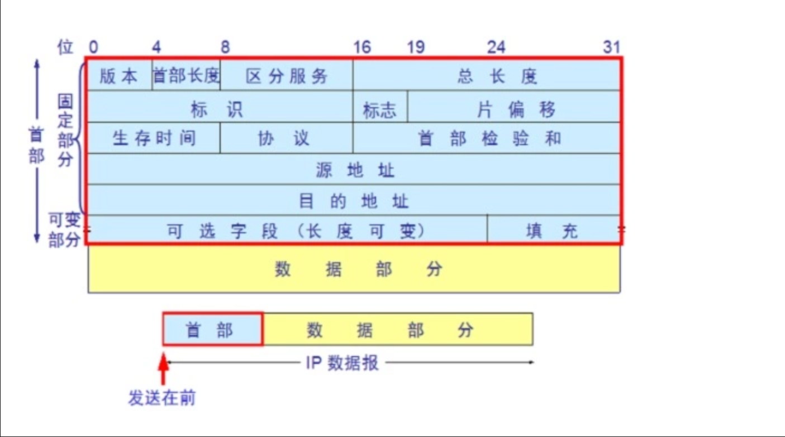

# IP

**IP package\(流弊必看\)**

解析数据包之前，先把 IP 协议图拿出来，如下：

  

所以 `((ip[2:2] - ((ip[0]&0xf)<<2)) - ((tcp[12]&0xf0)>>2))` 表示的数据长度

> `ip[2:2]` 从 ip 报文的第3个字节开始读2个字节，这个恰好就是 ip 包的总长度，单位是字节
>
> 0.0 `ip[2:2]`就是操作list/slice

可以看到，IP 报文头部采用`固定长度(20B) + 可变长度`构成，和TCP 头部类似。

然后下面对着抓到的数据包进行分析：

```text
## client ip : 21.49.22.4
$ telnet 21.49.22.1 7000
Trying 21.49.22.1...
Connected to 21.49.22.1.
Escape character is '^]'.
hi
^]
telnet> q
Connection closed.
​
# server : socat TCP-LISTEN:7000 -
$ tcpdump -i bond1 -n  -S  -X   port 7000 and host 21.49.22.4
tcpdump: verbose output suppressed, use -v or -vv for full protocol decode
listening on bond1, link-type EN10MB (Ethernet), capture size 262144 bytes
11:17:16.411759 IP 21.49.22.4.41482 > 21.49.22.1.afs3-fileserver: Flags [S], seq 3788194338, win 29200, options [mss 1460,sackOK,TS val 29382892 ecr 0,nop,wscale 7], length 0
    0x0000:  4510 003c 1ace 4000 4006 c977 1531 1604  E..<..@.@..w.1..
    0x0010:  1531 1601 a20a 1b58 e1cb 4222 0000 0000  .1.....X..B"....
    0x0020:  a002 7210 438c 0000 0204 05b4 0402 080a  ..r.C...........
    0x0030:  01c0 58ec 0000 0000 0103 0307            ..X.........
11:17:16.411818 IP 21.49.22.1.afs3-fileserver > 21.49.22.4.41482: Flags [S.], seq 3317761031, ack 3788194339, win 28960, options [mss 1460,sackOK,TS val 1832421462 ecr 29382892,nop,wscale 7
], length 0 0x0000:  4500 003c 0000 4000 4006 e455 1531 1601  E..<..@.@..U.1..
    0x0010:  1531 1604 1b58 a20a c5c1 0407 e1cb 4223  .1...X........B#
    0x0020:  a012 7120 5695 0000 0204 05b4 0402 080a  ..q.V...........
    0x0030:  6d38 8856 01c0 58ec 0103 0307            m8.V..X.....
11:17:16.411896 IP 21.49.22.4.41482 > 21.49.22.1.afs3-fileserver: Flags [.], ack 3317761032, win 229, options [nop,nop,TS val 29382892 ecr 1832421462], length 0
    0x0000:  4510 0034 1acf 4000 4006 c97e 1531 1604  E..4..@.@..~.1..
    0x0010:  1531 1601 a20a 1b58 e1cb 4223 c5c1 0408  .1.....X..B#....
    0x0020:  8010 00e5 241b 0000 0101 080a 01c0 58ec  ....$.........X.
    0x0030:  6d38 8856                                m8.V
11:17:20.252838 IP 21.49.22.4.41482 > 21.49.22.1.afs3-fileserver: Flags [P.], seq 3788194339:3788194343, ack 3317761032, win 229, options [nop,nop,TS val 29386733 ecr 1832421462], length 4
    0x0000:  4510 0038 1ad0 4000 4006 c979 1531 1604  E..8..@.@..y.1..
    0x0010:  1531 1601 a20a 1b58 e1cb 4223 c5c1 0408  .1.....X..B#....
    0x0020:  8018 00e5 9f9a 0000 0101 080a 01c0 67ed  ..............g.
    0x0030:  6d38 8856 6869 0d0a                      m8.Vhi..
11:17:20.252869 IP 21.49.22.1.afs3-fileserver > 21.49.22.4.41482: Flags [.], ack 3788194343, win 227, options [nop,nop,TS val 1832425303 ecr 29386733], length 0
    0x0000:  4500 0034 8c5e 4000 4006 57ff 1531 1601  E..4.^@.@.W..1..
    0x0010:  1531 1604 1b58 a20a c5c1 0408 e1cb 4227  .1...X........B'
    0x0020:  8010 00e3 568d 0000 0101 080a 6d38 9757  ....V.......m8.W
    0x0030:  01c0 67ed                                ..g.
11:17:24.470189 IP 21.49.22.4.41482 > 21.49.22.1.afs3-fileserver: Flags [F.], seq 3788194343, ack 3317761032, win 229, options [nop,nop,TS val 29390950 ecr 1832425303], length 0
    0x0000:  4510 0034 1ad1 4000 4006 c97c 1531 1604  E..4..@.@..|.1..
    0x0010:  1531 1601 a20a 1b58 e1cb 4227 c5c1 0408  .1.....X..B'....
    0x0020:  8011 00e5 f59a 0000 0101 080a 01c0 7866  ..............xf
    0x0030:  6d38 9757                                m8.W
11:17:24.509551 IP 21.49.22.1.afs3-fileserver > 21.49.22.4.41482: Flags [.], ack 3788194344, win 227, options [nop,nop,TS val 1832429560 ecr 29390950], length 0
    0x0000:  4500 0034 8c5f 4000 4006 57fe 1531 1601  E..4._@.@.W..1..
    0x0010:  1531 1604 1b58 a20a c5c1 0408 e1cb 4228  .1...X........B(
    0x0020:  8010 00e3 568d 0000 0101 080a 6d38 a7f8  ....V.......m8..
    0x0030:  01c0 7866                                ..xf
11:17:24.970781 IP 21.49.22.1.afs3-fileserver > 21.49.22.4.41482: Flags [F.], seq 3317761032, ack 3788194344, win 227, options [nop,nop,TS val 1832430021 ecr 29390950], length 0
    0x0000:  4500 0034 8c60 4000 4006 57fd 1531 1601  E..4.`@.@.W..1..
    0x0010:  1531 1604 1b58 a20a c5c1 0408 e1cb 4228  .1...X........B(
    0x0020:  8011 00e3 568d 0000 0101 080a 6d38 a9c5  ....V.......m8..
    0x0030:  01c0 7866                                ..xf
11:17:24.970864 IP 21.49.22.4.41482 > 21.49.22.1.afs3-fileserver: Flags [.], ack 3317761033, win 229, options [nop,nop,TS val 29391451 ecr 1832430021], length 0
    0x0000:  4510 0034 8d36 4000 4006 5717 1531 1604  E..4.6@.@.W..1..
    0x0010:  1531 1601 a20a 1b58 e1cb 4228 c5c1 0409  .1.....X..B(....
    0x0020:  8010 00e5 e136 0000 0101 080a 01c0 7a5b  .....6........z[
    0x0030:  6d38 a9c5                                m8..
​
​
​
## 主要分析这个
11:17:20.252838 IP 21.49.22.4.41482 > 21.49.22.1.afs3-fileserver: Flags [P.], seq 3788194339:3788194343, ack 3317761032, win 229, options [nop,nop,TS val 29386733 ecr 1832421462], length 4
    0x0000:  [4510 0038 1ad0 4000 4006 c979 1531 1604  E..8..@.@..y.1..
    0x0010:  1531 1601] {a20a 1b58 e1cb 4223 c5c1 0408  .1.....X..B#....
    0x0020:  8018 00e5 9f9a 0000 0101 080a 01c0 67ed  ..............g.
    0x0030:  6d38 8856} 6869 0d0a                        m8.Vhi..
    
## ip header 前20个固定字节
4510 0038 1ad0 4000 4006 c979 1531 1604 1531 1601
​
```

0.0 `-X` 以十六进制为单位显示字节数据。 hex，hexadecimal

When parsing and printing, in addition to printing the headers of each packet, print the data of each packet \(minus its link level header\) in hex and ASCII. This is very handy for analysing new protocols.

【1】`0x4` 4bit， **ip 协议版本** `0x4` 表示 IPv4。 `0x4510` --&gt; 前4bits即`0x4`

【2】`0x5` 4bit，**ip首部长度** 该字段表示单位是32bits\(4字节\) ，所以这个 ip 包的头部有 `5*4=20B`，这就可以推出，该 IP 报文头没有可选字段。4bit 可以表示最大的数为 0xF，因此，IP 头部的最大长度为 `15*4=60B`。该报文的 IP 头部我已经在报文中标注出来了。

所以，len\(ip\_header\) == \(ip\[0\] &0xf\)&lt;&lt;2 . &lt;&lt;2即 \* 4

【3】`0x10` 8bit，**服务类型 TOS** 该段数据组成为 3bit 优先权字段\(现已被忽略\) + 4bit TOS 字段 + 1bit 保留字段\(须为0\)。 4bit TOS 字段分别表示自小时延、最大吞吐量、最高可用性和最小费用。只能置其中 1bit，全为 0 表示一般服务。**现在大多数的TCP/IP实现都不支持TOS特性** 。可以看到，本报文 TOS 字段为全 0。 【4】`0x0038` 16bit， **IP 报文总长度** 单位字节，换算下来，该数据报的长度为 56 字节，数一下上面的报文，恰好 56B。

> int\('0x0038', 16\) == 56, \(3 \* 8 + 4\) \*2 == 56Bytes

从占位数来算， IP 数据报最长为 `2^16=65535B`，但大部分网络的链路层 MTU（最大传输单元）没有这么大，一些上层协议或主机也不会接受这么大的，故超长 IP 数据报在传输时会被分片。 【5】`0x1ad0` 16bit，**标识** 唯一的标识主机发送的每一个数据报。通常每发送一个报文，它的值+1。当 IP 报文分片时，该标识字段值被复制到所有数据分片的标识字段中，使得这些分片在达到最终目的地时可以依照标识字段的内容重新组成原先的数据。 【6】`0x4000` 3bit **标志** + 13bit **片偏移** 3bit 标志对应 R、DF、MF,目前只有后两位有效:

`0x4` ==&gt; `0100` 所以，DF=1，不分片。

DF : Don't Fragment,只有当DF=0时才允许分片。

MF：More Fragment ，MF=1即表示后面还有分片的数据包；MF=0表示这已是若干数据包中的最后一个。

13bit 片位移：本分片在原先数据报文中相对首位的偏移位。**（需要再乘以8）**

这个片位移？

【7】`0x40` 8bit **生存时间TTL** IP 报文所允许通过的路由器的最大数量。每经过一个路由器，TTL减1，当为 0 时，路由器将该数据报丢弃。TTL 字段是由发送端初始设置一个 8 bit字段.推荐的初始值由分配数字 RFC 指定。发送 ICMP 回显应答时经常把 TTL 设为最大值 255。TTL可以防止数据报陷入路由循环。本报文该值为 64。

```text
## linux 下默认ttl就是64
$cat /proc/sys/net/ipv4/ip_default_ttl
64
```

-、- 因为我的server和client是同网段的

【8】`0x06` 8bit **协议** 指出 IP 报文携带的数据使用的是哪种协议，以便目的主机的IP层能知道要将数据报上交到哪个进程。TCP 的协议号为6，UDP 的协议号为17。ICMP 的协议号为1，IGMP 的协议号为2。该 IP 报文携带的数据使用 TCP 协议，得到了验证。

0.0 tcp 我telent做的测试

【9】`0xc979` 16bit **IP 首部校验和** 由发送端填充。以本报文为例，先说这个值是怎么计算出来的。

```text
# 将校验和字段 16bit 值抹去变为 `0x0000`，然后将首部 20字节值相加
# 一个十六进制数是4bit.
0x4510 + 0x0038 + 0x1ad0 + 0x4000 + 0x4006 + 0x0000 + 0x1531 + 0x1604 + 0x1531 + 0x1601  = 0x27B95 = 0x13685
​
# 将上述结果的进位 2 与低 16bit 相加
0x3685 + 0x1 = 0x3686
​
# 0x3686 按位取反
# 卧槽，真的是0xc979
~(0x3686) ==> 0xc979
>>> ~(0x3686)
-13959
>>> ~(0x3686) & 0xffff
51577
>>> hex(~(0x3686) & 0xffff)
'0xc979'
​
## but,用计算机计算就不一样拉
## 这里是补码的缘故
>>> ~(0x3686)
-13959
​
```

结果 `0xc979` 即为该字段值！ 接收端验证的时候，进行以下计算

```text
# 20B 首部值相加
0x13685 +  0xc979 = 0x1fffe
​
# 将上述结果的进位 2 与低 16bit 相加
0xfffe + 0x1 = 0xFFFF
​
# 0xFFFF 按位取反
~(0xFFFF) = 0  <-- 正确
```

【10】`0x15311604` 32bit 源地址 可以通过一下 python 程序将 hex 转换成我们熟悉的点分 IP 表示法

```text
>>> import socket
>>> import struct
>>> int_ip=int("0x15311604",16)
## I : unsigned int
>>>socket.inet_ntoa(struct.pack('I',socket.htonl(int_ip)))
'21.49.22.4'
```

本报文中的 src addr 为 `21.49.22.4`，恰好就是发起请求的 IP。 【11】`0x15311601` 32bit 目的地址 经过计算为 `21.49.22.1`，恰好就是启 redis 服务那台机器的 IP。

由于该报文首部长度为 20B，因此没有**可变长部分**。

