# TCP

#### TCP 数据包分析

四元组： 源IP、目的IP、源端口、目的端口

五元组: 源IP、目的IP、传输层协议号、源端口、目的端口

**Protocol Headers**

```text
 +-------------+-------------------------+
 | Application |  HTTP Packet            |
 +-------------+-------------------------+
 | Transport   |  TCP Segment            |
 +-------------+-------------------------+
 | Network     |  IP Packet              |
 +-------------+-------------------------+
 | Link        |  Frame                  | 
 +-------------+-------------------------+         光纤
 | Physical    |  Bits                   | ====================> 
 +-------------+-------------------------+
 
 每一层的协议构成： 
 Packet = Protocol Header + Payload
 Payload 指传入这一层的数据内容，比如：
 TCP Segment = TCP header + HTTP data
 这个有点意思了啊，从上到下是加Protocol Header的过程，从下到上是去Protocol Headers的过程。
 0.0 所以IP Header 永远在 TCP Header 前面
```

0.0 传输层：Segement； 网络层：Package ；链路层：Frame； 物理层： Bits

有了这个认知之后，对于每一层协议的学习，最后就落实到每一层 header 的学习上了，学习 TCP 就是研究 TCP header 的构成，header 里的每一个 bit 位都有特别的用处，来实现协议层对于网络传输的控制。

**流弊操作**

[https://segmentfault.com/a/1190000015044878](https://segmentfault.com/a/1190000015044878)

**打印 80 端口，有数据的 tcp 包**

0.0 `Packet = IP Header + TCP/UDP Header + Data` IP Header永远在TCP Header前面--

因为原始的data是Application产生的，网络协议只是为了传输它！

```text
$ tcpdump 'tcp port 80 and (((ip[2:2] - ((ip[0]&0xf)<<2)) - ((tcp[12]&0xf0)>>2)) != 0)'
```

`ip[2:2]` 从 ip 报文的第3个字节开始读2个字节，这个恰好就是 ip 包的总长度，单位是字节 `ip[0]&0xf` 取的是 ip 报文第 1 个字节的低 4 位，`<< 2`（乘以 4），为 ip 头部长度，单位是字节 `tcp[12]&0xf0` 取的是 tcp 报文第 13 个字节的高 4 位，`>> 2` 其实等价于 `>> 4` 然后 `<< 2`，为 tcp 头部长度，单位是字节。 所以 `((ip[2:2] - ((ip[0]&0xf)<<2)) - ((tcp[12]&0xf0)>>2))` 表示的数据长度。这个长度计算真的强

后面会分析为何这样写表达式。

**TCP Segment**

One byte = collection of 8 bits

因为TCP包的单位是32 bites 即 4 bytes，所以说，TCP 的头部必须是 4字节的倍数,而大多数选项不是4字节倍数,不足的用 `NOP` 填充

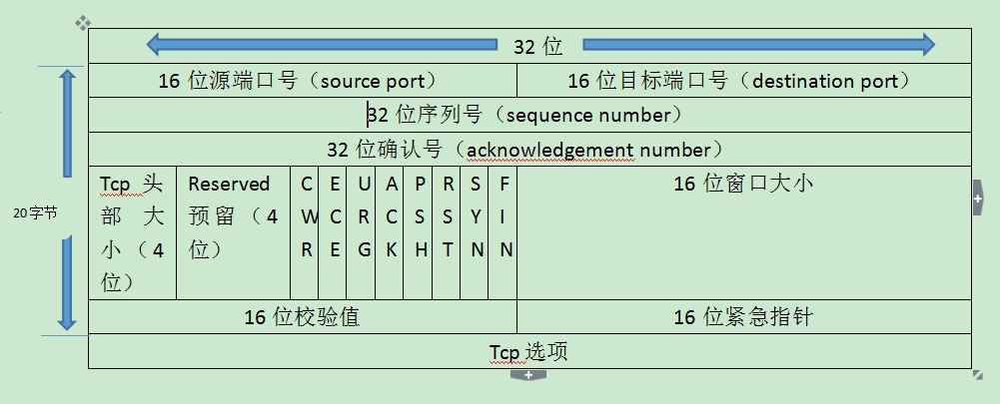

上图中的位是bit

* 源端口、目的端口号没什么好说的，2的16次方也就是65536。
* 32为序列号，sequence number，保证网络传输数据的顺序性。

  SYN Synchronize sequence numbers

  The sequence number of the first data octet in this segment \(exceptwhen SYN is present\). If SYN is present the sequence number is theinitial sequence number \(ISN\) and the first data octet is ISN+1.

* 32位确认号，acknowledgment number，用来确认确实有收到相关封包，内容表示期望收到下一个报文的序列号，用来解决丢包的问题。
* 头部大小，4位，**偏移量：最大值为0x0F**，即15，单位为32位\(bit\)，也就是4字节，所以TCP的头部最大为15\*4=60字节。
* Reserved 3位 ，预留字段，都为0
* TCP，标识段位

  **flags**是TCP报文中的标志信息，具体描述如下:

  Tcpflags are some combination of S \(SYN\), F \(FIN\), P \(PUSH\), R \(RST\), U \(URG\), W \(ECN CWR\), E \(ECN-Echo\) or `.` \(ACK\), or `none` if no flags are set.

  **PS**: `.`代表ACK啊

  表格如下：

  ```text
  Unskilled =  URG  =  (Not Displayed in Flag Field, Displayed elsewhere) 
  Attackers =  ACK  =  (Not Displayed in Flag Field, Displayed elsewhere)
  Pester    =  PSH  =  [P] (Push Data)
  Real      =  RST  =  [R] (Reset Connection)
  Security  =  SYN  =  [S] (Start Connection)
  Folks     =  FIN  =  [F] (Finish Connection)
            SYN-ACK =  [S.] (SynAcK Packet)
                       [.] (No Flag Set)
                       0.0 . is ACK
  ```

  end

  注意，Flag是安装下面顺序排列的

  * NS \(1 bit\): ECN-nonce - concealment protection
  * CWR：Congestion window reduced，拥塞窗口减少。拥塞窗口减少标志被发送主机设置，用来表明它接收到了设置ECE标志的TCP包。拥塞窗口是被TCP维护的一个内部变量，用来管理发送窗口大小。
  * ECN-Echo：显式拥塞提醒回应。当一个IP包的ECN域被路由器设置为11时，接收端而非发送端被通知路径上发生了拥塞。ECN使用TCP头部来告知发送端网络正在经历拥塞，并且告知接收端发送段已经受到了接收端发来的拥塞通告，已经降低了发送速率。
  * URG：为1时，**紧急指针（urgent pointer）有效，配合紧急指针使用**
  * ACK：为1时，确认号有效
  * PSH: 为1时，接收方应该尽快将这个报文段交给应用层
  * RST：为1时，释放连接，重连。
  * SYN：为1时，发起一个连接。
  * FIN：为1时，关闭一个连接。

* 16位窗口大小：占16bit。此字段用来进行流量控制，主要用于解决流控拥塞的问题。单位为字节数，这个值是本机期望一次接收的字节数。

  **所谓滑动窗口，可以理解成接收端所能提供的缓冲区大小。**TCP利用一个滑动的窗口来告诉发送端对它所发送的数据能提供多大的缓 冲区。由于窗口由16位bit所定义，所以接收端TCP 能最大提供65535个字节的缓冲。由此，可以利用窗口大小和第一个数据的序列号计算出最大可接收的数据序列号。

* 16位校验值: 占16bit。对整个TCP报文段，即TCP头部和TCP数据进行校验和计算，并由目标端进行验证。

  校验和覆盖整个TCP报文段：TCP首部和TCP数据，这个一个强制性的字段，一定是由发端计算和存储，并由收端进行校验

* 16位紧急指针:占16bit。它是一个偏移量，和序号字段中的值相加表示紧急数据最后一个字节的序号。

  只有URG=1时紧急指针才有效，紧急指针是一个正的偏移量，和序号字段中的值相加标示紧急数据最后一个字节的序号。TCP的紧急方式是发送端向另一端发送紧急数据的一种方式。

* 32位Tcp选项:一般包含在三次握手中。

分析下面的Wireshark的抓包数据：

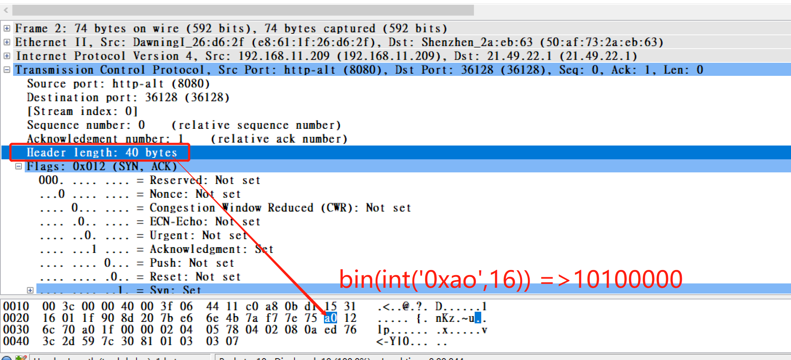

可以看到：

Header length： 40 bytes对应的是数据包的十六进制值是`a0`,转成二进制即`1010000`（8 bits）.TCP header length

即`(10100000 & 0xf0) >> 4 << 2` 前面解释过了`<< 2`等价于`* 4`,因为TCP packet的单位是32 bites即4 bytes.

Python代码验证：

要求： 使用代码验证tcp包格式，打印出tcp包的源端口、目的端口、头部长度。

**TCP 标志位**

**ACK**

If the ACK control bit is set this field contains the value of the next sequence number the sender of the segment is expecting to receive. **Once a connection is established this is always sent.**

0.0 一旦连接建立，Ack bit is always set.

TCP协议规定，只有ACK=1时有效，也规定连接建立后所有发送的报文的ACK必须为1

So until the connection is not established, packets can be sent without `ACK`.

**FIN**

finis即完，终结的意思， 用来释放一个连接。当 FIN = 1 时，表明此报文段的发送方的数据已经发送完毕，并要求释放连接。

**PSH**

这个PSH也有点意思，在push data时，`ack Number`的值不等于`seq Number + 1`。如下：

```text
  ## seq 81252688:81252771
  ##  ack 81252771
  21.49.22.1.36584 > 192.168.11.209.webcache: Flags [P.], cksum 0xf824 (incorrect -> 0x5d26), seq 81252688:81252771, ack 1249490392, win 229, options [nop,nop,TS val 1501371294 ecr 3984009034], length 83: HTTP, length: 83  GET / HTTP/1.1    15:19:46.244552 IP (tos 0x0, ttl 63, id 37522, offset 0, flags [DF], proto TCP (6), length 52)    
   192.168.11.209.webcache > 21.49.22.1.36584: Flags [.], cksum 0x6f16 (correct), seq 1249490392, ack 81252771, win 217, options [nop,nop,TS val 3984009034 ecr 1501371294], length 015:19:46.244853 IP (tos 0x0, ttl 63, id 37523, offset 0, flags [DF], proto TCP (6), length 603)
```

其他建立连接和断开连接的情况下，`ack number = seq number +1`

**RST**

未解之谜

[https://cjting.me/2019/08/28/tcp-queue/](https://cjting.me/2019/08/28/tcp-queue/)

Scapy 运行在用户空间，SYN/ACK 这个包内核会先收到。因为我们用的是 RawSocket，内核不知道我们在进行三次握手，内核突然收到了一个 SYN/ACK 包，同时这个包对应的端口没有相关的 Socket，那么内核会认为这是一个无效的数据包，返回 RST 断开连接。正常情况下，三次握手都是由内核完成，内核知道我们在握手，此时内核并不知道。

> RawSocket:

A common case for generating a reset is when a connection request arrives and no process is listening on the destination port.

还没到Userspace就在kernel space 给拒绝了？？？the linux kernel will receive the SYN-ACK first.

Since you are not completing the full TCP handshake your operating system might try to take control and can start sending RST \(reset\) packets, to avoid this we can use iptables:

> Essentially, the problem is that `scapy` runs in user space, and the linux kernel will receive the SYN-ACK first. The kernel will send a RST because it won't have a socket open on the port number in question, before you have a chance to do anything with `scapy`.
>
> The solution \(as the blog mentions\) is to firewall your kernel from sending a RST packet.
>
> 0.0 我们 c 代码类似`scapy` ？？？

因为我们的服务器监听的是6666端口，因此修改语句就是：

```text
iptables -t filter -I OUTPUT -p tcp --dport 6666 --tcp-flags RST RST -j DROP
```

流弊

0.0 这个挺重要的

[https://zhuanlan.zhihu.com/p/30791159](https://zhuanlan.zhihu.com/p/30791159)

RST表示复位，用来异常的关闭连接，在TCP的设计中它是不可或缺的。就像上面说的一样，发送RST包关闭连接时，不必等缓冲区的包都发出去（不像上面的FIN包），直接就丢弃缓存区的包发送RST包。而接收端收到RST包后，也不必发送ACK包来确认。

TCP处理程序会在自己认为的异常时刻发送RST包。例如，A向B发起连接，但B之上并未监听相应的端口，这时B操作系统上的TCP处理程序会发RST包。

又比如，AB正常建立连接了，正在通讯时，A向B发送了FIN包要求关连接，B发送ACK后，网断了，A通过若干原因放弃了这个连接（例如进程重启）。网通了后，B又开始发数据包，A收到后表示压力很大，不知道这野连接哪来的，就发了个RST包强制把连接关了，B收到后会出现connect reset by peer错误。

**TCP state**

**TIME\_WAIT**

可靠地实现TCP全双工连接的终止–TCP协议在关闭连接的四次挥手中，在主动关闭方发送的最后一个 ack\(fin\) ，有可能丢失，这时被动方会重新发fin, 如果这时主动方处于 CLOSED 状态 ，就会响应 rst 而不是 ack。所以主动方要处于 TIME\_WAIT 状态，而不能是 CLOSED .好厉害

> Closet state of Socket 收到 FIN 则用响应RST而不是ACK

so，TIME\_WAIT最后等待2MSL，就是在等待被动关闭方可能重发的FIN（由于被动发送方没收到最后一个adk），卧槽真的稳健。

TIME-WAIT：The only thing that can arrive in this state is a retranmission of the remote FIN. Acknowledge it, and restart 2 MSL timeout.

**MSL**

MSL： Max Segment Lifetime

Linux 下这个Max segment Lifetime默认值是 60s

```text
$ cat /proc/sys/net/ipv4/tcp_fin_timeout
60
## 修改默认值
$  sysctl -p /etc/sysctl.conf
net.ipv4.tcp_fin_timeout = 30 
# 下面这两是干嘛的
net.ipv4.tcp_tw_reuse=1
net.ipv4.tcp_tw_recycle=1
```

end

**SYN\_RCVD & 半连接队列溢出**

`tcp_max_syn_backlog` 可以控制 SYN 队列大小

```text
# net.ipv4.tcp_max_syn_backlog
$ cat /proc/sys/net/ipv4/tcp_max_syn_backlog
1024
​
```


从tcp握手包来看：

1. Client: 发送 SYN，连接状态进入 `SYN_SENT`
2. Server: 收到 SYN, 创建连接状态为 `SYN_RCVD/SYN_RECV` 的 Socket，响应 SYN/ACK
3. Client: 收到 SYN/ACK，连接状态从 `SYN_SENT` 变为 `ESTABLISHED`，响应 ACK
4. Server: 收到 ACK，连接状态变为 `ESTABLISHED`

Server 需要两个队列，分别存储 `SYN_RCVD` 状态的连接和 `ESTABLISHED` 状态的连接，这就是半连接队列和全连接队列。

SYN Flood 的思路很简单，发送大量的 SYN 数据包给 Server，然后不回应 Server 响应的 SYN/ACK，这样，Server 端就会存在大量处于 `SYN_RECV` 状态的连接，这样的连接会持续填充半连接队列，最终导致半连接队列溢出。

当半连接队列溢出时，Server 收到了新的发起连接的 SYN：

* 如果不开启 `net.ipv4.tcp_syncookies`：直接丢弃这个 SYN

  当收到 SYN Flood 攻击时，系统会直接丢弃新的 SYN 包，也就是正常客户端将无法和服务器通信。

  0.0 没有判断机制会影响normal client

* 如果开启：`net.ipv4.tcp_syncookies`

  开启后半连接队列即使已经满了，正常用户依旧可以和服务器进行通信

  * 如果全连接队列满了，并且 `qlen_young` 的值大于 1：丢弃这个 SYN
  * 否则，生成 syncookie 并返回 SYN/ACK 包

    如果启用了 syncookies，syn queue 的逻辑大小是没有限制的。

    > 利用一套巧妙的 syncookies 算法机制生成隐藏信息写入响应的 SYN+ACK 包中，等 client 回 ACK 时，server 再利用 syncookies 算法校验报文，校验通过后三次握手就顺利完成了。
    >
    > 0.0 大佬看内核源码的结论

`qlen_young` 表示目前半连接队列中，没有进行 SYN/ACK 包重传的连接数量。

**ESTABLISHD && 全队列队列溢出**

`int listen(int sockfd, int backlog)` Linux的内核调用，backlog默认是128。listen 的 backlog 参数同时指定了 socket 的 syn queue 与 accept queue 大小

结合这里的解释提炼一下：

* listen 的 backlog 参数同时指定了 socket 的 syn queue 与 accept queue 大小。
* accept queue 最大不能超过`net.core.somaxconn`的值，即:

  ```text
  max accept queue size = min(backlog, net.core.somaxconn)
  ```

* 如果启用了 syncookies \(`net.ipv4.tcp_syncookies=1`\)，当 syn queue 满了，server 还是可以继续接收 SYN 包并回复 SYN+ACK 给 client，只是不会存入 syn queue 了。因为会利用一套巧妙的 syncookies 算法机制生成隐藏信息写入响应的 SYN+ACK 包中，等 client 回 ACK 时，server 再利用 syncookies 算法校验报文，校验通过后三次握手就顺利完成了。**所以如果启用了 syncookies，syn queue 的逻辑大小是没有限制的**，
* syncookies 通常都是启用了的，所以一般不用担心 syn queue 满了导致丢包。syncookies 是为了防止 SYN Flood 攻击 \(一种常见的 DDoS 方式\)，攻击原理就是 client 不断发 SYN 包但不回最后的 ACK，填满 server 的 syn queue 从而无法建立新连接，导致 server 拒绝服务。
* 如果 syncookies 没有启用，syn queue 的大小就有限制，除了跟 accept queue 一样受`net.core.somaxconn`大小限制之外，还会受到`net.ipv4.tcp_max_syn_backlog`的限制，即:

  ```text
  max syn queue size = min(backlog, net.core.somaxconn, net.ipv4.tcp_max_syn_backlog)
  ```

0.0 真的秀

如果全连接队满了又会怎么样？应用程序调用 `accept` 的速度太慢，或者请求太多，都会导致这个情况。

当系统收到三次握手中第三次的 ACK 包，正常情况下应该是从半连接队列中取出连接，更改状态，放入全连接队列中。此时如果全连接队列满了的话：

* 如果设置了 `net.ipv4.tcp_abort_on_overflow`，那么直接回复 RST，同时，对应的连接直接从半连接队列中删除
* 否则，直接忽略 ACK，然后 TCP 的超时机制会起作用，一定时间以后，Server 会重新发送 SYN/ACK，因为在 Server 看来，它没有收到 ACK

如何验证 accept queue 满了呢？可以在容器的 netns 中执行`ss -lnt`看下:

```text
$ ss -lnt
State      Recv-Q Send-Q Local Address:Port                Peer Address:Port
LISTEN     129    128                *:80                             *:*
​
```

通过这条命令我们可以看到当前 netns 中监听 tcp 80 端口的 socket，`Send-Q` 为 128，`Recv-Q` 为 129。

什么意思呢？通过调研得知：

* 对于 `LISTEN` 状态，`Send-Q` 表示 accept queue 的最大限制大小，Recv-Q 表示其实际大小。
* 对于 `ESTABELISHED` 状态，`Send-Q` 和 `Recv-Q` 分别表示发送和接收数据包的 buffer。

**LISTEN 状态: Recv-Q 表示的当前等待服务端调用 accept 完成三次握手的 listen backlog （half open queue）数值，也就是说，当客户端通过 connect\(\) 去连接正在 listen\(\) 的服务端时，这些连接会一直处于这个 queue 里面直到被服务端 accept\(\)；Send-Q 表示的则是最大的 listen backlog （open queue）数值，这就就是上面提到的 min\(backlog, somaxconn\) 的值。**

所以，看这里输出结果可以得知 accept queue 满了，当 `Recv-Q` 的值比`Send-Q` 大 1 时表明 accept queue 溢出了，如果再收到 SYN 包就会丢弃掉。

导致 accept queue 满的原因一般都是因为进程调用 `accept()` 太慢了，导致大量连接不能被及时 “拿走”。

那么什么情况下进程调用 `accept()` 会很慢呢？猜测可能是进程连接负载高，处理不过来。

而负载高不仅可能是 CPU 繁忙导致，还可能是 IO 慢导致，当文件 IO 慢时就会有很多 `IO WAIT`，在 `IO WAIT` 时虽然 CPU 不怎么干活，但也会占据 CPU 时间片，影响 CPU 干其它活。

最终进一步定位发现是 nginx pod 挂载的 nfs 服务对应的 nfs server 负载较高，导致 IO 延时较大，从而使 nginx 调用 `accept()` 变慢，accept queue 溢出，使得大量代理静态图片文件的请求被丢弃，也就导致很多图片加载不出来。

accept queue 的最大大小会受 `net.core.somaxconn`内核参数的限制，可以通过下面方式设置：

```text
$ cat /proc/sys/net/core/somaxconn
32768
```

引申：

accept queue 的最大大小会受 `net.core.somaxconn`内核参数的限制，我们看下 pod 所在节点上这个内核参数的大小：

```text
$ cat /proc/sys/net/core/somaxconn
32768
```

是 32768，挺大的，为什么这里 accept queue 最大大小就只有 128 了呢？

`net.core.somaxconn` 这个内核参数是 namespace 隔离了的，我们在容器 netns 中再确认了下：

```text
$ cat /proc/sys/net/core/somaxconn
128
```

为什么只有 128？看下 stackoverflow 这里的讨论:

```text
The "net/core" subsys is registered per network namespace. And the initial value for somaxconn is set to 128.
```

原来新建的 netns 中 `somaxconn` 默认就为 128，在 `include/linux/socket.h` 中可以看到这个常量的定义:

```text
/* Maximum queue length specifiable by listen.  */#define SOMAXCONN  128
```

**很多人在使用 k8s 时都没太在意这个参数，为什么大家平常在较高并发下也没发现有问题呢？**

因为通常进程 `accept()` 都是很快的，所以一般 accept queue 基本都没什么积压的数据，也就不会溢出导致丢包了。对于并发量很高的应用，还是建议将 `somaxconn` 调高。虽然可以进入容器 netns 后使用 `sysctl -w net.core.somaxconn=1024` 或 `echo 1024 > /proc/sys/net/core/somaxconn` 临时调整，但调整的意义不大，因为容器内的进程一般在启动的时候才会调用 `listen()`，然后 accept queue 的大小就被决定了，并且不再改变。

容器中设置方法：

* k8s securitygroup特性

  ```text
  apiVersion: v1
  kind: Pod
  metadata:
    name: sysctl-example
  spec:
    securityContext:
      sysctls:
      - name: net.core.somaxconn
        value: "8096"
  ```

  end

* initcontainer

end

**三次握手和四次挥手抓包**

结合Wireshark 和 tcpdump 分析，一份是tcpdump直接输出，另一份是`-w`保存在文件的数据，wireshark打开。

看完了上面的TCP的介绍，下面我们拿三次握手做一次实验

分析10个包，简单易懂。

console1

```text
$ curl 192.168.11.209:8080
```

console2

```text
## 由于执行了两次一次-w保存，一次没保存所以 数值上有差异。
$  tcpdump -i bond1 -n   -S -vv host 192.168.11.209  
​
   ## length 83 即 81252771 - 81252688
   ## 因为抓包是使用了-S 参数
   ##        --absolute-tcp-sequence-numbers
   ##          Print absolute, rather than relative, TCP sequence numbers.
   ## 没有使用-S时，seq都使用相对值即从 1开始 eg ： seq 1: 84
```

**握手： SYN**

Package One： client want to connect server. 客户端想和服务端建立连接，先发SYN打招呼。

SYN： Used to initiate and establish a connection.

客户端发起建立连接请求，SYN标志为1，以及随机生成了一个值为`81252687`的sequence number。

> 0.0 TCP package 中有一个单位\(4 bytes/32 bits\) 来表示sequence number，32位所以数值很大。

```text
 ## 初次握手所以没有acknowledge number
 21.49.22.1.36584 > 192.168.11.209.webcache: Flags [S], cksum 0xf7d9 (incorrect -> 0xe489), seq 81252687, win 29200, options [mss 1460,sackOK,TS val 1501371294 ecr 0,nop,wscale 7], lengt
​
```

第一个TCP的握手包是没有ACK number的且将SYN位置为1

下图中，Package 4 - Package 10 这些包的ACK bit都是set的，0.0一旦连接建立，ack bit always sets.

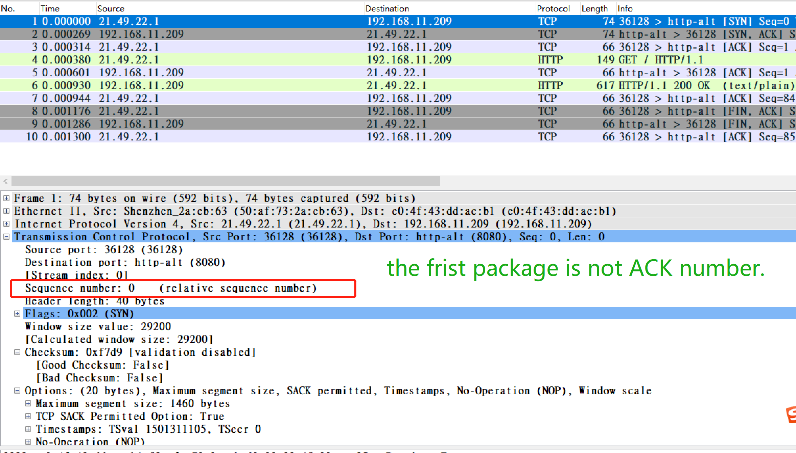

0.0 Sequence number在TCP中占了32 bits, so 对应下面是8个十六进制数。

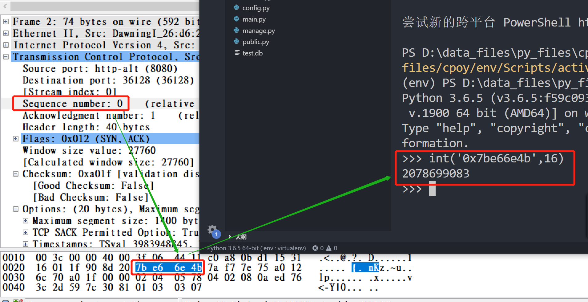

**握手：SYN + ACK**

因为TCP 连接是双向的，所以server 也有主动发起一个SYN，表明自己也愿意建立连接。

Package Two：Server acknowledge a establish request from client and send a SYN to client.

SYN： Used to initiate and establish a connection.

ACK：Helps to confirm to the other side that it has received the SYN.

```text
    192.168.11.209.webcache > 21.49.22.1.36584: Flags [S.], cksum 0xd541 (correct), seq 1249490391, ack 81252688, win 27760, options [mss 1400,sackOK,TS val 3984009034 ecr 1501371294,nop,ws
cale 7], length 015:19:46.244289 IP (tos 0x0, ttl 64, id 51922, offset 0, flags [DF], proto TCP (6), length 52)
```

可以看到`Server_Ack number = Client_Seq number +1`即`81252687 + 1 = 81252688` 且flag变成了`Flags [S.]`、

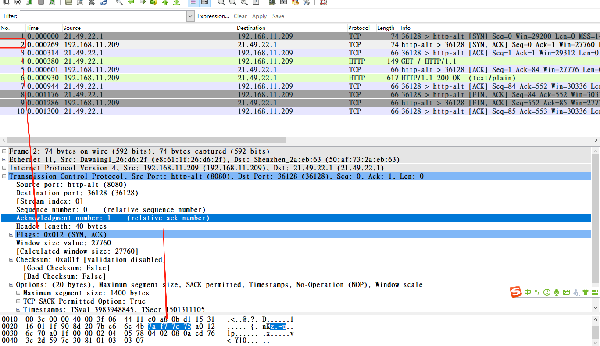

end

**握手： ACK**

Package Three： Client acknowledge the SYN package from Server.

ACK：Helps to confirm to the other side that it has received the SYN.

```text
21.49.22.1.36584 > 192.168.11.209.webcache: Flags [.], cksum 0xf7d1 (incorrect -> 0x6f5d), seq 81252688, ack 1249490392, win 229, options [nop,nop,TS val 1501371294 ecr 3984009034], len
gth 015:19:46.244357 IP (tos 0x0, ttl 64, id 51923, offset 0, flags [DF], proto TCP (6), length 135)
```

可以看到`Clinet_Ack number = Server_Seq number +1`即`1249490391 + 1 = 1249490392` .

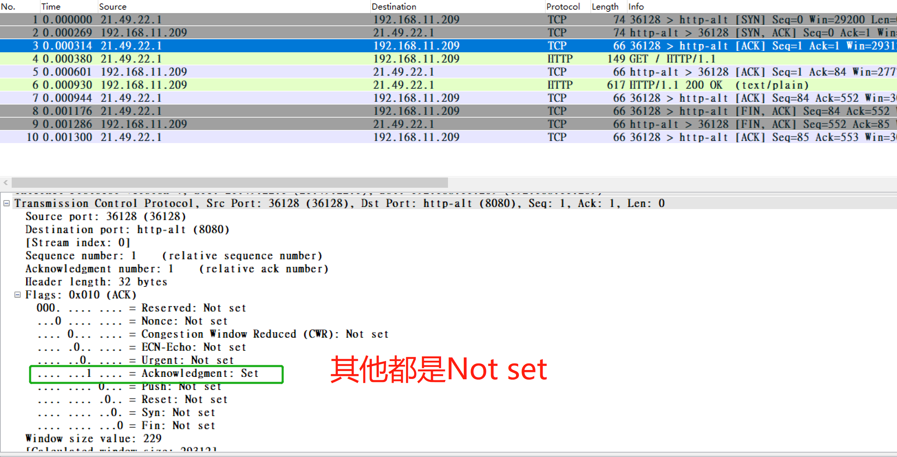

**总结握手：**

由于TCP是可靠的全双工传输协议，所以Client和Server之间都需要相互确认连接。再Server响应client的SYN时，捎带发送自己的SYN，可以减少一次单独发送SYN的开销，设计者真的聪明。

**数据传输：**

PSH: 为1时，接收方应该尽快将这个报文段交给应用层。`[P.]` 和`[.]`是成对存在，确保收到数据一致。

```text
   ## length 83 即 81252771 - 81252688
   ## 因为抓包是使用了-S 参数
   ##        --absolute-tcp-sequence-numbers
   ##          Print absolute, rather than relative, TCP sequence numbers.
   ## 没有使用-S时，seq都使用相对值即从 1开始 eg ： seq 1: 84
​
## 注意，data push传输时，ack的值不是seq+1，谢谢。 
   21.49.22.1.36584 > 192.168.11.209.webcache: Flags [P.], cksum 0xf824 (incorrect -> 0x5d26), seq 81252688:81252771, ack 1249490392, win 229, options [nop,nop,TS val 1501371294 ecr 398400
9034], length 83: HTTP, length: 83  GET / HTTP/1.1
    
15:19:46.244552 IP (tos 0x0, ttl 63, id 37522, offset 0, flags [DF], proto TCP (6), length 52)
    192.168.11.209.webcache > 21.49.22.1.36584: Flags [.], cksum 0x6f16 (correct), seq 1249490392, ack 81252771, win 217, options [nop,nop,TS val 3984009034 ecr 1501371294], length 0
15:19:46.244853 IP (tos 0x0, ttl 63, id 37523, offset 0, flags [DF], proto TCP (6), length 603)
    192.168.11.209.webcache > 21.49.22.1.36584: Flags [P.], cksum 0x8669 (correct), seq 1249490392:1249490943, ack 81252771, win 217, options [nop,nop,TS val 3984009034 ecr 1501371294], len
gth 551: HTTP, length: 551  HTTP/1.1 200 OK
    
15:19:46.244870 IP (tos 0x0, ttl 64, id 51924, offset 0, flags [DF], proto TCP (6), length 52)
    21.49.22.1.36584 > 192.168.11.209.webcache: Flags [.], cksum 0xf7d1 (incorrect -> 0x6cda), seq 81252771, ack 1249490943, win 237, options [nop,nop,TS val 1501371295 ecr 3984009034], len
gth 015:19:46.245125 IP (tos 0x0, ttl 64, id 51925, offset 0, flags [DF], proto TCP (6), length 52)
```

end

**http 的close connection为什么只有三个包（还没解决）**

如图：

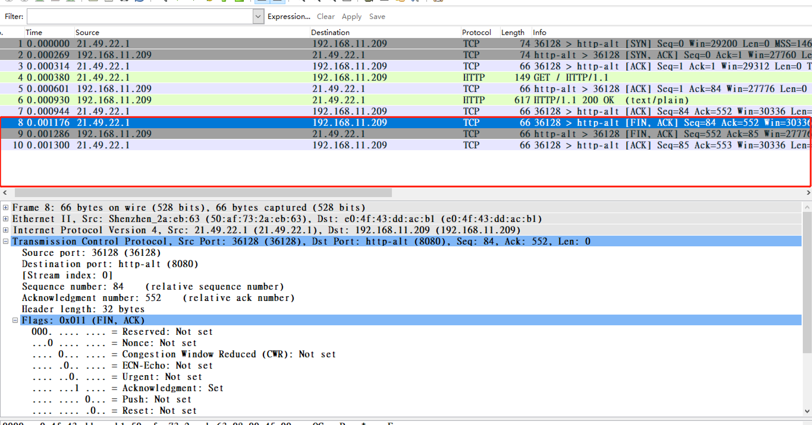

0.0 只有三个次交互就结束了tcp connection，http协议怎么定义的，怎么忽视了tcp的四次挥手吖

**挥手：**

`TCP` 是全双工模式，需要两边的连接全部关闭，此 TCP 会话才算完全关闭，四次挥手使得 `TCP` 的全双工连接能够可靠的终止。

针对 `HTTP` 的请求，可以进行 `Follow`，选择 `TCP Stream` 即可，如下图所示：

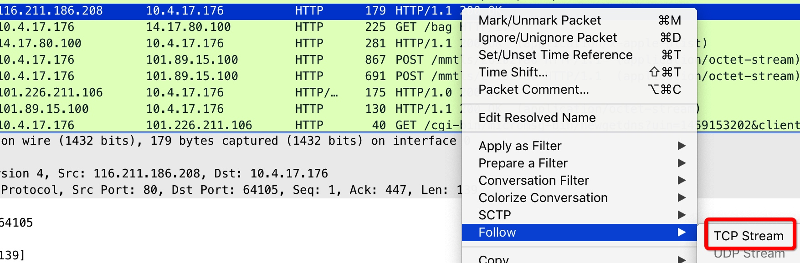

此时，可以看到四次挥手的抓包情况，如下图所示：

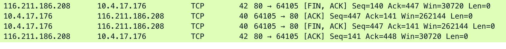

**挥手：FIN+ACK**

```text
15:19:46.244853 IP (tos 0x0, ttl 63, id 37523, offset 0, flags [DF], proto TCP (6), length 603)
    192.168.11.209.webcache > 21.49.22.1.36584: Flags [P.], cksum 0x8669 (correct), seq 1249490392:1249490943, ack 81252771, win 217, options [nop,nop,TS val 3984009034 ecr 1501371294], len
gth 551: HTTP, length: 551  HTTP/1.1 200 OK
15:19:46.244870 IP (tos 0x0, ttl 64, id 51924, offset 0, flags [DF], proto TCP (6), length 52)
    21.49.22.1.36584 > 192.168.11.209.webcache: Flags [.], cksum 0xf7d1 (incorrect -> 0x6cda), seq 81252771, ack 1249490943, win 237, options [nop,nop,TS val 1501371295 ecr 3984009034], len
gth 015:19:46.245125 IP (tos 0x0, ttl 64, id 51925, offset 0, flags [DF], proto TCP (6), length 52)
-------
## client发起终止连接 seq number使用的还是最后一次接受数据时的 sequence number
    21.49.22.1.36584 > 192.168.11.209.webcache: Flags [F.], cksum 0xf7d1 (incorrect -> 0x6cd9), seq 81252771, ack 1249490943, win 237, options [nop,nop,TS val 1501371295 ecr 3984009034], le
ngth 015:19:46.245231 IP (tos 0x0, ttl 63, id 37524, offset 0, flags [DF], proto TCP (6), length 52)
```

0.0 下图显示的是relative value 而不是absolute value

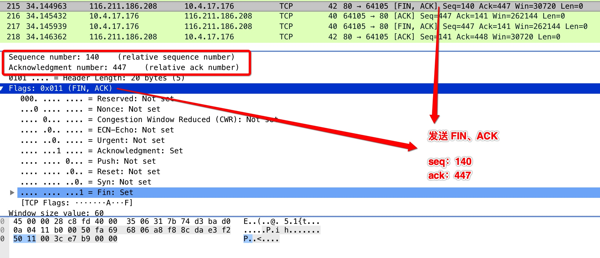

通讯完毕，客户端发送FIN标志的数据包请求关闭连接。

```text
02:55:40.416919 IP (tos 0x0, ttl 64, id 44251, offset 0, flags [DF], proto TCP (6), length 40)
    172.16.117.132.56878 > 220.181.38.148.80: Flags [F.], cksum 0x24f9 (incorrect -> 0x590b), seq 39940673, ack 2621492551, win 30016, length 0
```

end

**挥手： ACK**

服务端响应返回ACK，表示自己受到了client FIN请求。

```text
02:55:40.417278 IP (tos 0x0, ttl 128, id 10248, offset 0, flags [none], proto TCP (6), length 40)
    220.181.38.148.80 > 172.16.117.132.56878: Flags [.], cksum 0xd35b (correct), seq 2621492551, ack 39940674, win 64239, length 0
```

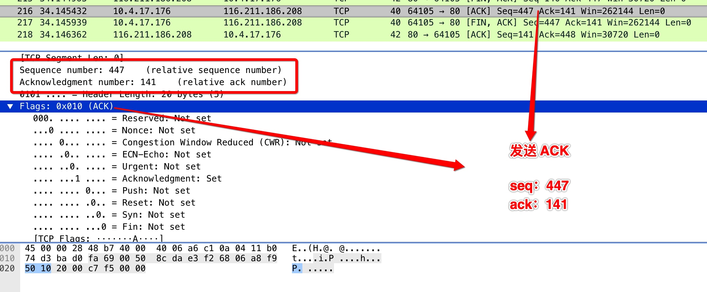

**挥手：FIN+ACK**

服务端发送最后的数据包给客户端.

```text
02:55:40.450349 IP (tos 0x0, ttl 128, id 10249, offset 0, flags [none], proto TCP (6), length 40)
    220.181.38.148.80 > 172.16.117.132.56878: Flags [FP.], cksum 0xd352 (correct), seq 2621492551, ack 39940674, win 64239, length 0
```

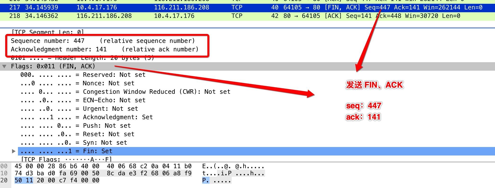

**挥手：ACK**

client响应最后的ACK，完成挥手四步。

```text
02:55:40.450403 IP (tos 0x0, ttl 64, id 63792, offset 0, flags [DF], proto TCP (6), length 40)
    172.16.117.132.56878 > 220.181.38.148.80: Flags [.], cksum 0x590a (correct), seq 39940674, ack 2621492552, win 30016, length 0
```

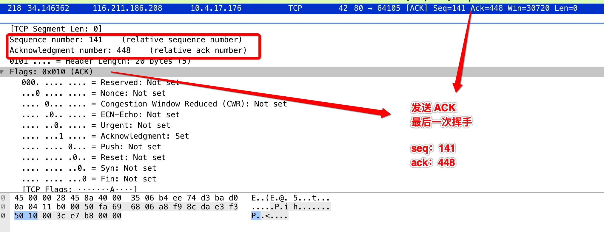

**总结挥手：**

四次挥手两个`FIN+ACK` 包 加 两个`ACK`包。

还是由于是全双工的缘故，断开连接也需要通信双方各自发起，对端给予响应。

但是不同于TCP连接建立时，**断开连接时不能复用**。即需要单独发ACK去响应对端的FIN请求，因为A想断开时，B可能数据还没发完，收到A的断开请求后，B先回应知道了。但是还是要做完手头正在传输的工作（这样才能保证A收到的数据完整），当B完成当前传输后，再发送FIN，表示自己也可以中断连接了，这时A在响应ACK，成功断开连接。

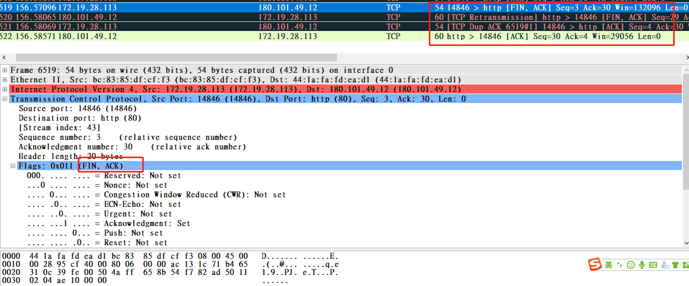

在前面说过，断开连接端可以是 `Client` 端，也可以是 `Server` 端，我上面的例子首先发起 `close` 的一方是 `Server` 端。

**第一次挥手：** 服务端发送一个 `[FIN+ACK]` 报文，表示自己没有数据要发送了，想断开连接，并进入 `fin_wait_1` 状态（不能再发送数据到客户端，但能够发送控制信息 `ACK` 到客户端）。

**第二次挥手：** 客户端收到 `[FIN]` 报文后，客户端知道不会再有数据从服务端传来，发送 `ACK` 进行确认，客户端进入 `close_wait` 状态。此时服务端收到了客户端对 `FIN` 的 `ACK` 后，进入 `fin_wait2` 状态。

**第三次挥手：** 客户端发送 `[FIN ACK]` 报文给对方，表示自己没有数据要发送了，客户端进入 `last_ack` 状态。服务端收到了客户端的 `FIN` 信令后，进入 `time_wait` 状态，并发送 `ACK` 确认消息。

**第四次挥手：** 服务端在 `time_wait` 状态下，等待 2MSL\(MSL是数据分节在网络中存活的最长时间\) 一段时间，没有数据到来的，就认为对面已经收到了自己发送的 `ACK` 并正确关闭了进入 `close` 状态，自己也断开了到客户端的 `TCP` 连接，释放所有资源。当客户端收到服务端的`ACK` 回应后，会进入 `close` 状态，并关闭本端的会话接口，释放相应资源。

so，TIME\_WAIT最后等待2MSL，就是在等待被动关闭方可能重发的FIN（由于被动发送方没收到最后一个adk），卧槽真的稳健。Close状态的Socket 收到FIN会响应RST而不是ACK.

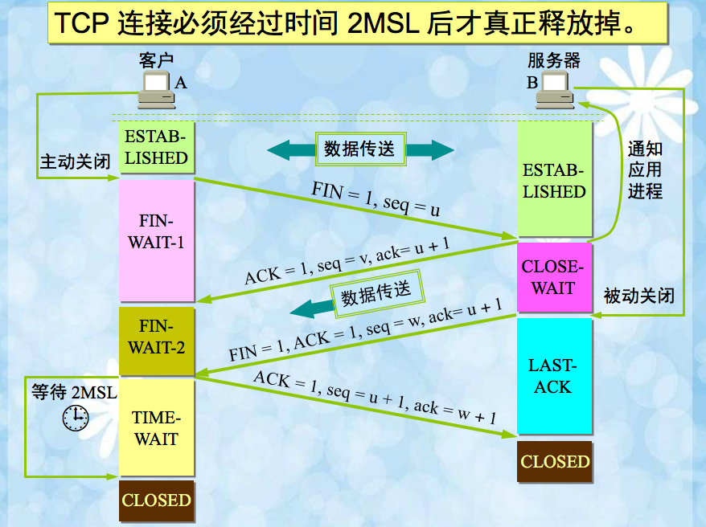

**纯TCP协议抓包**

1. `$ socat TCP-LISTEN:7000 -`
2. console1 :

   `socat - TCP:IP:Port` \(建立连接即握手包\)

   Ctrl + C（断开连接即挥手包）

3. console2: tcpdum -i Interface -S -n host IP and Port

完美的握手和挥手包啊：

```text
### establish connect
13:05:42.721872 IP 21.49.22.1.57188 > 192.168.11.209.afs3-fileserver: Flags [S], seq 613001225, win 29200, options [mss 1460,sackOK,TS val 1579727772 ecr 0,nop,wscale 7], length 0
13:05:42.722113 IP 192.168.11.209.afs3-fileserver > 21.49.22.1.57188: Flags [S.], seq 3640232842, ack 613001226, win 27760, options [mss 1400,sackOK,TS val 4062365512 ecr 1579727772,nop,wsc
ale 7], length 013:05:42.722152 IP 21.49.22.1.57188 > 192.168.11.209.afs3-fileserver: Flags [.], ack 3640232843, win 229, options [nop,nop,TS val 1579727772 ecr 4062365512], length 0
### push data
13:05:45.067066 IP 21.49.22.1.57188 > 192.168.11.209.afs3-fileserver: Flags [P.], seq 613001226:613001230, ack 3640232843, win 229, options [nop,nop,TS val 1579730117 ecr 4062365512], lengt
h 413:05:45.067305 IP 192.168.11.209.afs3-fileserver > 21.49.22.1.57188: Flags [.], ack 613001230, win 217, options [nop,nop,TS val 4062367857 ecr 1579730117], length 0
13:05:53.528372 IP 21.49.22.1.57188 > 192.168.11.209.afs3-fileserver: Flags [P.], seq 613001230:613001235, ack 3640232843, win 229, options [nop,nop,TS val 1579738578 ecr 4062367857], lengt
h 513:05:53.528632 IP 192.168.11.209.afs3-fileserver > 21.49.22.1.57188: Flags [.], ack 613001235, win 217, options [nop,nop,TS val 4062376318 ecr 1579738578], length 0
## close connect
## 4 次
13:06:03.300559 IP 21.49.22.1.57188 > 192.168.11.209.afs3-fileserver: Flags [F.], seq 613001235, ack 3640232843, win 229, options [nop,nop,TS val 1579748351 ecr 4062376318], length 0
13:06:03.340655 IP 192.168.11.209.afs3-fileserver > 21.49.22.1.57188: Flags [.], ack 613001236, win 217, options [nop,nop,TS val 4062386131 ecr 1579748351], length 0
13:06:03.801402 IP 192.168.11.209.afs3-fileserver > 21.49.22.1.57188: Flags [F.], seq 3640232843, ack 613001236, win 217, options [nop,nop,TS val 4062386591 ecr 1579748351], length 0
13:06:03.801435 IP 21.49.22.1.57188 > 192.168.11.209.afs3-fileserver: Flags [.], ack 3640232844, win 229, options [nop,nop,TS val 1579748851 ecr 4062386591], length 0
​
```

Closing a Connetion

有意思--

[https://tools.ietf.org/html/rfc793\#section-3.5](https://tools.ietf.org/html/rfc793#section-3.5)

```text
  There are essentially three cases:
​
    1) The user initiates by telling the TCP to CLOSE the connection
​
    2) The remote TCP initiates by sending a FIN control signal
​
    3) Both users CLOSE simultaneously
​
  Case 1:  Local user initiates the close
​
    In this case, a FIN segment can be constructed and placed on the
    outgoing segment queue.  No further SENDs from the user will be
    accepted by the TCP, and it enters the FIN-WAIT-1 state.  RECEIVEs
    are allowed in this state.  All segments preceding and including FIN
    will be retransmitted until acknowledged.  When the other TCP has
    both acknowledged the FIN and sent a FIN of its own, the first TCP
    can ACK this FIN.  Note that a TCP receiving a FIN will ACK but not
    send its own FIN until its user has CLOSED the connection also.
​
  Case 2:  TCP receives a FIN from the network
​
    If an unsolicited FIN arrives from the network, the receiving TCP
    can ACK it and tell the user that the connection is closing.  The
    user will respond with a CLOSE, upon which the TCP can send a FIN to
    the other TCP after sending any remaining data.  The TCP then waits
    until its own FIN is acknowledged whereupon it deletes the
    connection.  If an ACK is not forthcoming, after the user timeout
    the connection is aborted and the user is told.
​
  Case 3:  both users close simultaneously
​
    A simultaneous CLOSE by users at both ends of a connection causes
    FIN segments to be exchanged.  When all segments preceding the FINs
    have been processed and acknowledged, each TCP can ACK the FIN it
    has received.  Both will, upon receiving these ACKs, delete the
    connection.
```

0.0

如果通过`curl and tcpdump`抓包，看不懂完整的TCP流程的，我感觉这个和HTTP协议有关。

**抓取GET包**

TCP的包的头部是固定20 byte不是意味着TCP头部等于20

```text
$ tcpdump 'tcp[(tcp[12]>>2):4] = 0x47455420'
​
tcp[12]即tcp的第12个字节位，1 byte = 8 bit
由于该byte中前4bit表示首部长度，因为有6 bit是保留位
所以不需要tcp[12]&0xf0取高四位
0.0所以 tcp[(tcp[12]>>2):4]即tcp[len(head_tcp):4]
​
(tcp[12]>>2) 其实是，先>>4再<<2的简写。
先<<4是为了去掉后面的0000(预留位)，因为高位权值大，然后就得到TCP head的长度了，但是它的单位是32bits即4bytes，所以需要乘4即<<2。(tcp[12]>>4)<<2 简写即 tcp[12]>>2
​
下面这样写更稳妥：
 & 0xf0这个操作防止有的软件会利用预留位来存东西，默认都是0000, 0xf0转成二进制即11110000
 & 按位与，即只保留前四位。
(tcp[12]&0xf0)>>2)
```

我知道我的毛病了...

①以为看懂了: `tcp[12]>>2` ， 粗心

②不去追究：`(tcp[12]&0xf0)>>2)`, 懒...

你不知道按位与和十六进制`0x`嘛，或许是思维欠缺，下次绝不允许。

**Python code**

socket实际上是进程间通信\(**Inter-process communication，IPC**\)的一种形式。单机模式下，你有许多方式可以实现IPC，比如文件、管道、共享内存等等，因此这里也并不是socket的用武之地。socket真正的强大在于跨平台的通信，即网络通信\(换言之，网络通信归根结底是进程间的通信\)，几乎是“只此一家，别无分号”。因此，我们常说的socket，又称netwok socket。

> _A network socket is an endpoint of a connection across a computer network._

简单的tcp socket server：

```text
import socket
import struct
​
with socket.socket(socket.AF_INET, socket.SOCK_STREAM) as s:
    s.bind(("0.0.0.0", 30003))
    s.listen(1)
    response = struct.pack("7s", bytes('Recive\n',encoding='utf-8'))
    # return a new socket representing the connection, amd the address of the client
    conn, addr = s.accept()
    with conn:
        print('Connect by', addr)
        while True:
            data = conn.recv(65565)
            if not data:
                break
            conn.send(response)
            
$ python3.5 server.py
Connect by ('127.0.0.1', 42720)
​
```

end

一个数据包由IP头部信息、TCP/UDP头部信息和数据构成:

`Packet = IP Header + TCP/UDP Header + Data`

在python中创建一个socket，具体格式如下：

`s = socket.socket(AF_INET, SOCK_STREAM)`

参数解释\(后2者一般使用默认即可，有用到再讲解\):

* family - 用于指定socket的地址类型，前缀AF即Address Family的缩写。最常见的有`AF_INET`和`AF_INET6`两种，分别表示使用IPv4和IPv6协议
* type - 用于指定socket的类型，使用SOCK前缀。常见的有以下几种类型：
  1. `SOCK_STREAM`：使用TCP或STCP协议，面向连接的socket
  2. `SOCK_DGRAM`：使用UDP协议，无连接的socket
  3. `SOCK_RAW`：这类socket，数据包将绕过运输层，因此可以在应用层得到数据包的头部

     Python 抓包器则使用`SOCK_RAW`,使用"IPPROTO\_RAW"协议，它会告诉系统我们将提供网络层和传输层。

一般，使用`AF_INET`和`SOCK_STREAM`/`SOCK_DGRAM`就能应付绝大多数情况了。因为INET socket几乎占了socket总数的99%，而stream socket和datagram socket又是这绝大多数中的绝大多数。

**raw socket**

client Code 运行在用户空间，SYN/ACK 这个包内核会先收到。因为我们用的是 RawSocket，内核不知道我们在进行三次握手，内核突然收到了一个 SYN/ACK 包，同时这个包对应的端口没有相关的 Socket，那么内核会认为这是一个无效的数据包，返回 RST 断开连接。正常情况下，三次握手都是由内核完成，内核知道我们在握手，此时内核并不知道。

0.0 Raw Socket 太底层了？？？

**抓IP Package**

抓包器要使用raw socket，并指定放行的协议，根据首部的不同，解析方法有不同，但套路类似。

```text
### 可以看到原始的字节流
# cat socket_raw.py
import socket
​
with socket.socket(socket.AF_INET, socket.SOCK_RAW, socket.IPPROTO_TCP) as s:
    while True:
        print(s.recvfrom(65565))
        
# python3.5  socket_raw.py 
(b'E\x14\x00(\nx@\x00m\x06eu\xcak\xc9\xe3\xac\x1f]`\xb8\xa5\x00\x16p\x81g\x92l/\x9f\xf7P\x10\x01\xfcs\x13\x00\x00', ('202.107.201.227', 0))
...
(b'E\x14\x00(\ny@\x00m\x06et\xcak\xc9\xe3\xac\x1f]`\xb8\xa5\x00\x16p\x81g\x92l/\xa0\xabP\x10\x01\xfcr_\x00\x00', ('202.107.201.227', 0))
​
​
### 0.0 
### 然后根据IP header的格式来取数据。
### 注意的是，Socket处理的是字节流，单位是bytes，而IP Package的单位是32 bits即 4 bytes.
import socket
import socket
from struct import unpack
​
with socket.socket(socket.AF_INET, socket.SOCK_RAW, socket.IPPROTO_TCP) as s:
    while True:
        # 创建的套接字，无论是TCP还是UDP，都能够通过 recvfrom函数接收数据包。
        raw_packet = s.recvfrom(65565)  # (data, addr)         
        packet = raw_packet[0]  # data         
        raw_iph = packet[0:20]  # 尚未解析的IP数据报头部固定部分         
        # unpack(fmt, buffer) - 根据指定的格式化字符串来拆解给定的buffer         
        # B 单字节的整型         
        # H 双字节的整型         
        # s bytes，前加数字表示取4字节的bytes         
        iph = unpack("!BBHHHBBH4s4s", raw_iph)
        fields = {}
        fields["Version"] = iph[0] >> 4  # 版本字段与IP数据报头部共享一个字节，通过右移操作取得单独的版本字段         
        # fields["IP Header Length"] = (iph[0] & 0xF) * 4  # 首部长度字段的1代表4个字节 
        fields["IP Header Length"] = (iph[0] & 0xF) << 2
        fields["Type of Service"] = iph[1]  # 区分服务，一般情况下并不使用         
        fields["Total Length"] = iph[2]  # IP首部+数据的总长度，即len(packet)         
        fields["Identification"] = iph[3]  # 标识         
        flags = iph[4] >> 13  # 标识位与片偏移共享2个字节，且最高位并且未使用         
        fields["MF"] = 1 if flags & 1 else 0  # 测试最低位         
        fields["DF"] = 1 if flags & 1 else 0  # 测试中间位         
        fields["Fragment Offset"] = iph[4] & 0x1FFF  # 位与操作取得片偏移         
        fields["Time to Live"] = iph[5]  # 生存时间，单位是跳数         
        fields["Protocol"] = iph[6]  # 数据报携带的数据使用的协议，TCP为6         
        fields["Header Checksum"] = iph[7]  # 首部校验和         
        # socket.inet_ntoa(..)         
        # - convert an ip address from 32-bit packed binary format to string format         
        fields["Source Address"] = socket.inet_ntoa(iph[8])
        fields["Destination Address"] = socket.inet_ntoa(iph[9])
​
        #for k, v in fields.items():  # 遍历打印，由于是dict，因此打印是无序的             
        #   print(k, ':', v)
        ## baidu.com ip
        if fields["Destination Address"] == "103.235.46.39" or fields["Source Address"] == "103.235.46.39"  :
            for k, v in fields.items():  
                print(k, ':', v)
        print("")
```

end

**抓tcp Segment**

[https://xiaix.me/python-shi-yong-scapy-jin-xing-zhua-bao/](https://xiaix.me/python-shi-yong-scapy-jin-xing-zhua-bao/)

**自己定义ip包**

数据包注入

[https://blog.csdn.net/a4230787/article/details/80301113](https://blog.csdn.net/a4230787/article/details/80301113)

**Websocket**

[https://websockets.readthedocs.io/en/stable/intro.html](https://websockets.readthedocs.io/en/stable/intro.html)

0.0 需要Python大于3.6.1

**TCP queue**

[https://cjting.me/2019/08/28/tcp-queue/](https://cjting.me/2019/08/28/tcp-queue/)

**Websocket**

没有其他能像 WebSocket 一样实现全双工传输的技术了，迄今为止，大部分开发者还是使用 Ajax 轮询来实现，但这是个不太优雅的解决办法，WebSocket 虽然用的人不多，可能是因为协议刚出来的时候有安全性的问题以及兼容的浏览器比较少，但现在都有解决。如果你有这些需求可以考虑使用 WebSocket：

1. 多个用户之间进行交互；
2. 需要频繁地向服务端请求更新数据。

比如弹幕、消息订阅、多玩家游戏、协同编辑、股票基金实时报价、视频会议、在线教育等需要高实时的场景。

WebSocket 是一种标准协议，用于在客户端和服务端之间进行双向数据传输。但它跟 HTTP 没什么关系，它是基于 TCP 的一种独立实现。

以前客户端想知道服务端的处理进度，要不停地使用 Ajax 进行轮询，让浏览器隔个几秒就向服务器发一次请求，这对服务器压力较大。另外一种轮询就是采用 long poll 的方式，这就跟打电话差不多，没收到消息就一直不挂电话，也就是说，客户端发起连接后，如果没消息，就一直不返回 Response 给客户端，连接阶段一直是阻塞的。

> 问题核心还是，HTTP 协议设计的初衷本身就是请求/响应模式、
>
> [https://kuaibao.qq.com/s/20180312G08OMA00?refer=spider](https://kuaibao.qq.com/s/20180312G08OMA00?refer=spider)

而 WebSocket 解决了 HTTP 的这几个难题。当服务器完成协议升级后（ HTTP -&gt; WebSocket ），服务端可以主动推送信息给客户端，解决了轮询造成的同步延迟问题。由于 WebSocket 只需要一次 HTTP 握手，服务端就能一直与客户端保持通信，直到关闭连接，这样就解决了服务器需要反复解析 HTTP 协议，减少了资源的开销。

> WebSocket协议是借用HTTP协议的`101 switch protocol`来达到协议转换的，从HTTP协议切换成WebSocket通信协议。
>
> ```text
> # http://nginx.org/en/docs/http/websocket.html
> location /chat/ {
>  proxy_pass http://backend;
>  proxy_http_version 1.1;
>  proxy_set_header Upgrade $http_upgrade;
>  proxy_set_header Connection "upgrade";
> }
> 嗷，这段配置到底什么操作。           
> 首先，要指定使用http1.1协议，因为http1.1协议的协议头才包含Upgrade。
> 然后通过指定Upgrade将http协议升级到不同版本(比如2.0)或者转换成：websocket
> Connection指定长连接类型为upgrade
> ```
>
> end

**偏移量**

**TCP的偏移量**

TCP偏移量出现在TCP报头里，它主要是指TCP报头的长度。TCP偏移量字段的长度是1字节（后四位预留），以32比特（4个字节）字长表示TCP报头的长度。

0.0 这个偏移量就是tcp\[12\]了

end

**IP的偏移量**

没看懂

[https://blog.csdn.net/cumirror/article/details/4869770](https://blog.csdn.net/cumirror/article/details/4869770)

IP数据包在网络中进行传输，如果数据包的大小超过网络设备的MTU值，则需要进行分段传输。分段偏移量用来标识数据包在该数据流中的位置，也可以理解为使用同一个IP标识发送多个数据包时的顺序号。发送主机给第一个分段数据包的偏移量赋值为0，对于其后的分段，该偏移量的值是MTU值减去上一个IP报头的大小，所以我们也可以说IP分段偏移量是指数据包中某个分段相对与第一分段在数据包中的位置。 下面我们举一个实例。我在我的机器（192.168.0.90）的CMD窗口中执行“ping 192.168.0.1 -l 3000 -n 1”命令，同时在科来网络分析系统中设定一个过滤器，只捕获从192.168.0.90到192.168.0.1的单方向数据，由于3000远远大于了以太网的MTU值，所以它会被分段传输。这时我们来看捕获到的数据包

从图1可知中，共捕获到了三个数据包，第一个协议是ICMP，后面两个是IP Fragment，前面两个数据包的大小是1518字节，第三个是86字节。第一个数据包的IP偏移量是0，第二个是185，第三个是370。 这三个数据包的详细情况如下表： 数据包编号 IP分段标志 IP偏移量 传输数据 1 更多分段置1 0　　0字节 1518-14-20-8-4＝1472 2 更多分段置1 185　1480字节 1518-14-20-4＝1480 3 更多分段置0 370　2960字节　 86-14-20-4＝48 上表中，第1个数据包中，多了一个ICMP报头，所以在计算传输的数据时，多减了8个字节的ICMP报头，而后面的两个数据包由于存在ICMP的报头开销，所以不需要减去8字节的ICMP报头。将传输的数据加起来，1472+1480+48=3000，与测试的数据完全吻合。 注意：如果有更多的分段，按照此规则依次累加即可，同时所有分段数据包的IP标识都是相同的

